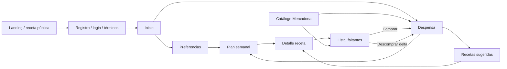

# KetoHoy — Product & Engineering Audit

Auditoría del 2 de octubre de 2026 · Producción pública: https://ketohoy.es/ · Checkout local: `/Users/sergioballesteros/ketohoy`.

Diagnóstico exclusivamente: no se han aplicado correcciones, actualizado dependencias, desplegado ni modificado la base de datos original. Las escrituras de prueba se hicieron sobre una copia desechable de SQLite y cuentas de auditoría locales. Había cambios previos del usuario, incluidos términos/consentimiento y despliegue: se han conservado y se distinguen del comportamiento público actualmente servido. El informe describe el estado observado, no una certificación de seguridad, accesibilidad o cumplimiento legal.

## 1. Executive Summary

KetoHoy tiene una base pequeña y razonable para una beta: SSR para contenido público, componentes propios, estilos coherentes, autenticación con sesiones revocables, ownership en despensa/lista/planes, validación Zod en numerosos endpoints, protección CSP y pruebas útiles. La navegación principal funciona, la compra mueve productos a despensa en el caso normal, editar cantidades persiste y los diálogos mantienen Tab dentro. No se observó overflow horizontal de documento en 56 combinaciones de siete pantallas y ocho anchuras.

La parte menos terminada es el contrato de producto y datos: ingrediente, cantidad, stock y paquete no significan lo mismo en las distintas pantallas. El menú puede quedar incompleto sin recuperación y una elección explícita puede saltarse restricciones. El catálogo tiene categorías rotas, respuestas fuera de orden y puntuaciones keto demasiado categóricas para datos estimados. La ruta de crear productos no valida la sesión y los manuales se comparten entre cuentas. Compra/descompra no es atómica. La entrega y las migraciones necesitan protección antes de llevar los cambios locales a producción.

**46 hallazgos: P0: 0 · P1: 14 · P2: 27 · P3: 5.** No demostrar P0 no significa descartar vulnerabilidades fuera del alcance probado. P1 concentra incidencias de alta relevancia, algunas reproducidas y otras riesgos estructurales claramente identificados. Los avisos de `npm audit` no se convierten automáticamente en hallazgos P0: el advisory crítico de Next observado requiere un uso de ImageResponse que no se encontró aquí.

Las cinco intervenciones de mayor impacto son: autorización/privacidad del catálogo (KH-001/KH-013), atomicidad de compra (KH-002/KH-006), cantidades y necesidades reales (KH-005), preferencias y menú completo (KH-003/KH-004), y clasificación keto con procedencia fiable (KH-007/KH-025). E2E y entrega segura son condiciones para implementarlas con confianza (KH-010/KH-011/KH-035).

### Método, evidencia y límites

- Discovery con grafo de código, lectura de funciones y tracing de callers; lectura directa posterior para contexto y Unicode real. Los `??` que devolvió ocasionalmente el grafo no son corrupción del texto de la app.
- Se leyeron README, STATUS, pendientes, configuración, schema, seed, auth, proxy, reglas/scoring, integraciones, rutas y componentes de los flujos descritos. Se consultó la guía local de Next 16 antes de interpretar el proxy.
- Se ejecutó build de producción y servidor local aislado en `127.0.0.1:3100`. SQLite se copió con backup consistente; no se ejecutó seed contra la BD original. No hubo registro, compra, ataque ni cambio en producción.
- Navegador Chromium headed mediante Playwright: alta local con consentimientos, preferencias, catálogo/favoritos, despensa alta/edición/borrado/undo, recetas, generación/sustitución, compra/reversión; teclado, modales, reduced motion, red y consola. Los requests deliberadamente erróneos se limitaron al servidor local.
- Evidencia cruda sin cookies/tokens/contraseñas: [API probes](audit-assets/api-probes.json), [responsive y flujos](audit-assets/browser-probes.json), [interacciones lentas](audit-assets/interaction-probes.json), [segunda pasada](audit-assets/second-pass-probes.json), [rendimiento/SEO](audit-assets/performance-seo-probes.json), [dependencias](audit-assets/dependency-audit.json). [Guía de evidencia](audit-assets/README.md).
- `npm test`: **19 archivos, 156 tests, todos pasan**. `npm run lint`: pasa. `npm run build`: pasa, 42 entradas de rutas. `npm run test:e2e`: **1 fallo de setup; 26 no ejecutados**, por contrato de registro desactualizado. No se presenta como cobertura E2E satisfactoria.
- Variables: DATABASE_URL disponible; Google ID/secret y Unsplash disponibles en entorno local, sin publicar valores. RESEND_API_KEY ausente; APP_URL/COOKIE_SECURE se configuraron solo para servidor aislado HTTP. RECIPE_IMAGE_AUTOFETCH=false. Correo/OAuth no completados con proveedor real. No instalar dependencias fue necesario.
- Confianza: **Confirmado** = reproducido o contrato verificable en código; **riesgo por código** = camino posible, no incidencia en VPS; **Needs verification** = resultado no demostrado. Cada hallazgo aclara cuál aplica. Prioridad es impacto esperado, no prueba de frecuencia. Esfuerzos XS/S/M/L son alcance relativo, no plazos.
- No se midieron retención, conversión, CWV de campo ni satisfacción de usuarios. No hubo dispositivo físico, Safari/iOS, lector AT real, credenciales de observabilidad/VPS ni cuentas productivas. Se ofrecen recomendaciones y comprobaciones específicas para cerrar esos límites.

## 2. Product Map

### Stack y decisiones reales

| Capa | Implementación | Evaluación |
|---|---|---|
| Aplicación | Next 16.3.4 App Router, React 19.2.4, TypeScript, handlers `/api` | Monolito adecuado; no hace falta separar servicios por este alcance |
| Persistencia | Prisma 7.8 + adapter better-sqlite3, SQLite | Adecuado para una instancia; constraints/semántica importan más que cambiar de BD |
| Estado/fetch | useState/useEffect locales + apiFetch; no store global ni query library | Simple; loaders concretos necesitan cancelación, estados coherentes y errores |
| SSR/cache | Landing/recetas en servidor; React cache para receta; home unstable_cache 60 s | Contenido indexable correcto; caché privada sin invalidación causa KH-014 |
| Catálogo | Mercadona HTTP, caché en memoria 12 h y request inflight compartido por proceso | Evita estampida en instancia única; parcial/demo/timeouts necesitan contrato |
| Recetas/menús | 67 recetas en copia local, 207 ingredientes; scoring determinista y pool barajado | No genera recetas con IA. Selecciona corpus existente; catálogo finito explica escasez |
| Auth | scrypt con salt, sesiones aleatorias persistidas como hash, expiración 30 días, HttpOnly/SameSite=Lax | Revocación/ownership correctos en muchos endpoints; cookie-presence no es autorización |
| OAuth/correo | Google state + PKCE, token exchange servidor; Resend para verificación/reset | Flujo existe; entrega/callback reales no completados en auditoría |
| Fotos | Unsplash con selección persistida/backfill, next/image | Auto-fetch desactivado por defecto es buena decisión; curación insuficiente |
| UI/motion | Tailwind 4, tokens forest/lima, DM Sans/Syne self-hosted, lucide, Sheet/Chip/Toast/Skeleton propios | No hay Framer Motion instalada; animaciones CSS y timers de cierre |
| Entrega | GitHub CI → workflow_run → SSH OVH/Caddy/PM2, backups y Prisma migrate | Mantener simple; atomicidad de release/baseline/restore pendiente |
| Observabilidad | console.error/warn, PM2, healthcheck HTTP en deploy | No se encontró analytics/error tracking/RUM en repo; sistemas externos desconocidos |

### Rutas, funciones y estados críticos

| Ruta | Objetivo/función | Acceso y estados |
|---|---|---|
| `/` | Landing anónima o inicio con recomendación por franja horaria Madrid | SSR; anónimo/sesión/términos/empty/error; contenido cambia según sesión |
| `/login?modo=registro` | Email/contraseña o Google | Modo, validación, busy, error, sesión creada; local exige adulto/términos |
| `/forgot-password` | Solicitar enlace | Respuesta genérica, proveedor caído, rate limit |
| `/reset-password?token=…` | Nueva contraseña | Token inválido/usado/caducado, guardando, éxito; entrega real no auditada |
| `/verify-email?token=…` | Verificar correo | Token, verificación/reenvío; cuenta puede tener sesión antes de verificar |
| `/accept-terms` | Aceptar versión actual | Nueva ruta local; cuenta legacy/Google/email, rechazo/salida |
| `/legal` | Términos/privacidad | Público local, contenido borrador; producción no mostró enlaces en portada/alta |
| `/inventory` | Presencia/cantidad por producto | Carga/vacío/error, búsqueda externa, manual, editar, eliminar, undo |
| `/explore` | Catálogo Mercadona, buscar/categorizar/favoritos/añadir | Carga/error/demo/parcial, qty optimista por producto, favoritos en localStorage |
| `/meals` | Sugerencias por preferencias y despensa | Pool reducido/fallback, más resultados, añadir faltantes, detalle |
| `/recipes/:id` | Ingredientes/pasos/tiempo/faltantes | Público SSR/SEO, sesión para acción; 404 real comprobado |
| `/weekly-plan` | Generar siete días × cuatro tomas, cambiar plato | Sin plan, generando, completo/parcial, swap, añadir faltantes por receta |
| `/shopping-list` | Pendientes/comprados, cantidades/precios, compra→despensa | Optimismo, transfer/reverse, limpiar, undo, error; sin offline persistido |
| `/preferences` | Modo, pescado/cerdo/lácteos, tiempo, cuenta/verificación/logout | Carga, editando, guardando/guardado/error; sin edición completa de perfil/export/delete |
| `/robots.txt`, `/sitemap.xml`, manifest/iconos | Descubrimiento e instalación básica | Landing/recetas indexables; app privada noindex por defecto; manifest no es SW |

Principales APIs: auth register/login/logout/me/forgot/reset/verify/resend/google/accept-terms; products/list/search/create; Mercadona search/category/detail/add; pantry GET/POST/PATCH/DELETE; preferences GET/PATCH; recipes/suggestions/detail/add-to-shopping-list; weekly-plan GET/generate/PATCH meal; shopping GET/POST/DELETE/quantity/check/mark-bought. Se inspeccionó tanto autorización como ownership, no solo las pantallas.

### Entidades y relaciones

User → Session/AuthToken y aceptación/versiones; User → Preferences, PantryItem, WeeklyPlan y ShoppingListItem. WeeklyPlan → WeeklyMeal → Recipe → RecipeIngredient → Product opcional. Product es global (Mercadona/seed y manual, este último causa KH-013). PantryItem registra Float/unit/expiry pero disponibilidad usa presencia. ShoppingListItem registra quantity string, checked, pantryDelta/pantryCreated para reversión. Falta separar ingrediente/ración/necesidad/envase; falta unicidad de varias relaciones por usuario (KH-034).

La disponibilidad clasifica presencia mediante IDs/nombres y puntuación; el menú permite minAvailability:0 para que una despensa pequeña no excluya todo. Restricciones y tiempo filtran recetas del corpus. Los pools por tipo toman la mitad mejor puntuada, mínimo cuatro, y repiten hasta siete intentando evitar consecutivas. No se consume stock al cocinar ni se calcula macro total/raciones. Eso puede ser una decisión MVP válida si el copy no promete cantidades o planificación nutricional precisa.

## 3. User Journey Audit

### Landing pública

**Objetivo:** entender qué resuelve KetoHoy y decidir crear cuenta. **Funciona:** propuesta breve, CTA gratuito contrastado, tres pasos, recetas reales enlazadas, FAQ sobre coste/origen y disclaimer nutricional; SSR rápido y textos legibles. **Problemas:** la promesa de compra semanal excede KH-005/KH-027; fotos discordantes KH-039; CTA solo al inicio y preview social pobre KH-043; producción sin footer legal mientras local ya lo añade KH-046. No se inventan testimonials/credenciales para rellenar confianza. **Mejora:** explicar producto real con menú→necesidades, curar cuatro imágenes y completar información/CTA final. Ver [landing 320](audit-assets/production-landing-320.png) y [1440](audit-assets/production-landing-1440.png).

### Registro

**Objetivo:** obtener cuenta con mínima fricción y saber qué acepta. **Funciona:** email/inputMode/autocomplete, mínimo de contraseña, mostrar/ocultar con nombre accesible, feedback busy/error, validación servidor; versión local incorpora adulto y aceptación separada de información de privacidad. **Problemas:** suite E2E no sigue nuevo contrato KH-010; diferencias prod/local KH-046; salto a inicio sin guía KH-026; modo URL/contexto KH-042. Inputs/modo siguen editables durante submit; verificar conservación de intención si se cambia modo durante respuesta lenta. **Mejora:** probar contrato completo y retorno contextual; guía derivada de datos, sin aumentar alta con preguntas innecesarias. [Registro público 390](audit-assets/production-register-390.png).

### Login, Google y recuperación

**Objetivo:** entrar/reanudar receta o recuperar acceso. **Funciona:** sesiones hash/revocables, password scrypt, Google PKCE/state, cookies HttpOnly, error y reset/verificación implementados. **Problemas:** returnTo ausente KH-042; recovery proveedor caído revela existencia KH-021; timeouts KH-024; flujo real de entrega y Google queda pendiente. **Mejora:** identidad de respuesta en recuperación, retorno interno validado, pruebas token expirado/usado y proveedor caído. No se interpreta no verificar email antes de navegar como bug sin requisito; importa que reset/verificación permanezcan correctos.

### Primer uso / onboarding

**Objetivo:** entender qué añadir y obtener un menú útil. **Funciona:** empty states no bloquean, acceso directo a secciones y posibilidad de generar con despensa vacía. **Problemas:** no hay onboarding separado/persistido; se salta de alta a una recomendación con defaults y preferencias poco visibles KH-026; defaults de tiempo inconsistentes KH-014. **Mejora:** tres pasos opcionales en home con siguiente CTA, saltar y completar después; no crear wizard complejo ni pedir datos médicos.

### Inicio autenticado

**Objetivo:** elegir siguiente comida y ver qué queda pendiente. **Funciona:** recomendación por franja Madrid y foto, contador/enlaces a despensa y compra. **Problemas:** caché vieja KH-014, fallo técnico como cero KH-032 y “puedes hacer” basado en umbral/presencia KH-015. Zona Madrid es deliberada para mercado español; otros husos Needs verification si el mercado se amplía. **Mejora:** reflejar mutaciones inmediatamente, diferenciar error y mostrar faltantes/criterio real.

### Despensa

**Objetivo:** registrar/editar lo que hay en casa rápidamente. **Funciona:** grupos, manual + búsqueda compartida, sheet, edición de cantidad/unidad y undo; alta 3 kg→edición 5 kg→borrado→undo conservó 5 kg. **Problemas:** stock/unidades KH-005/KH-015, alta duplicada KH-016, spinner KH-018, errores undo KH-020, foco KH-019; no búsqueda local para despensa grande KH-029. **Mejora:** contrato de cantidad, recuperación robusta y filtro local. No necesita motor de inventario empresarial ni virtualización sin medir.

### Catálogo y detalle producto

**Objetivo:** encontrar un envase y añadirlo con confianza. **Funciona:** filtros/subfiltros, nombre/imagen/precio, +/- optimista bloqueado por producto y favoritos persistidos tras reload. **Problemas:** categoría incompatible KH-008, race KH-009, estimación keto KH-007, fallback invisible KH-023, import lento KH-024, AT KH-038. **Mejora:** consulta vigente única, contratos compartidos, procedencia junto al badge y detalle nutricional honesto. Favoritos son deliberadamente locales al dispositivo; no hay sincronización entre cuentas/dispositivos. No se observó hydration mismatch de favoritos en visita real; no se propone backend para favoritos sin necesidad.

### Preferencias y cuenta

**Objetivo:** establecer límites claros y conservarlos. **Funciona:** radio modes, exclusiones separadas y slider de tiempo, guardar y reenvío verificación/logout. **Problemas:** dirty/saving KH-017, defaults/cache KH-014, explicit swap KH-003, nutrición KH-025 y sin contrato de borrado/exportación KH-030. **Mejora:** explicar que modo es filtro de recetas, no objetivo clínico de gramos; estado guardado verificable y efecto de cambios sobre plan existente. No se añade alergias automáticamente a una lista que solo ofrece “evitar”.

### Generación y menú semanal

**Objetivo:** tener siete días completos y ajustar platos. **Funciona:** selección local rápida del corpus, preferencia/pantry ranking, sustituir sin rehacer todo, transacción de reemplazo del plan, feedback/skeleton, navegación por días. **Problemas:** siete snacks KH-004, swap incompatible KH-003, no compra agregada KH-027, Hoy/activo KH-044 y scroll reduced motion KH-037. **Mejora:** contrato completo/parcial con recuperación y preservar plan anterior; después compra agregada correcta. No mostrar progreso porcentual inventado para una operación indivisible. [Plan móvil](audit-assets/local-plan-390.png) y [desktop](audit-assets/local-plan-1440.png).

### Recetas sugeridas y detalle

**Objetivo:** decidir y cocinar con ingredientes/pasos comprensibles. **Funciona:** SSR público, title/canonical/OG/JSON-LD, pasos legibles, tiempo/dificultad, relación despensa/lista y botón con busy/done/error. **Problemas:** matching/stock KH-015, cantidades sin raciones KH-005, acción repetida acumula, foto KH-039, retorno tras alta KH-042. **Mejora:** conservar cantidad original y marcar qué falta; distinguir recetas “con ingredientes presentes” de “listas”; porciones/objetivo nutricional solo cuando datos permitan. No se inventa macro total de receta a partir de macros por 100 g de envases.

### Lista de compra / supermercado

**Objetivo:** reconocer y marcar productos con una mano. **Funciona:** botones grandes, nombres accesibles de comprar/cantidad, precio “estimado”, comprados separados, actualización inmediata y enlace a despensa; comprar 2→stock 2→revertir funcionó. A 320 px ocultar miniatura libera sitio para texto/stepper. **Problemas:** transferencia no atómica KH-002, nueva necesidad oculta KH-006, cantidades KH-005, undo KH-020, sin snapshot offline KH-028, saltos KH-041. La lista separa pendiente/comprado, no agrupa por pasillo; no se conoce orden real de cada tienda. **Mejora:** primero fiabilidad/cantidades/offline de lectura; después grouping opcional por categoría si ayuda a listas reales, sin prometer rutas de tienda. [Lista 320](audit-assets/local-shopping-320.png).

### Configuración, logout y estados peligrosos

**Objetivo:** salir, entender datos y gestionar cuenta. **Funciona:** logout revoca sesión servidor y hay aceptación versionada local. **Problemas:** export/delete/retención KH-030, manuales globales KH-013 y snapshot futuro debe limpiar cuenta KH-028. **Mejora:** procedimiento operativo verificable antes de UI compleja. Limpiar comprados explícitamente no equivale a quitar despensa; copy actual explica esa distinción. No recomendar confirmaciones en cada borrado: undo fiable es menor fricción.

### Coherencia visual y microcopy transversal

La paleta forest/lima, radios de cards/sheets, tipografía y lucide forman un lenguaje reconocible. Hay `focusRing`, `Chip`, `KetoBadge`, `Skeleton`, `Sheet` y `Toast`: conviene reutilizarlos, no introducir un segundo design system. auth incluye hex inline equivalentes y varios tamaños de campos/botones; se pueden mapear a tokens existentes cuando se toquen, pero no constituyen por sí solos refactor prioritario. No se encontraron sombras/hover exagerados que justifiquen rediseño completo.

| Actual | Propuesta | Motivo / relación |
|---|---|---|
| “Muy keto” en rebozado sin macros | “Estimación por categoría” / “Sin datos nutricionales” | Confianza y precisión, KH-007 |
| “recetas que puedes hacer” con presencia parcial | “Recetas con ingredientes en tu despensa”; mostrar faltantes | Evitar prometer stock suficiente, KH-015 |
| “No se pudo cargar el catálogo” por categoría inválida | Quitar chip inválido; para red real “No pudimos cargar Fruta. Reintentar” | Corregir causa y conservar contexto, KH-008 |
| Plan generado con 21 huecos | “No hay recetas compatibles para desayuno, comida y cena. Revisa tus preferencias; conservamos tu plan anterior.” | Salida concreta, KH-004 |
| “Guardado” para snapshot anterior | “Cambios sin guardar” / “Guardando…” / “Preferencias guardadas” según revisión | Estado fiable, KH-017 |
| “Too many requests” | “Demasiados intentos. Vuelve a probar en N segundos.” | Usar retryAfterSeconds ya existente, pendiente de unificación de errores |
| “Marcar favorito” repetido | “Marcar [nombre] como favorito” | Nombre accesible contextual, KH-038 |
| Snapshot antiguo sin conexión (actual no existe) | “Sin conexión · lista guardada a las HH:mm. Los cambios necesitan conexión.” | Frescura y persistencia honestas, KH-028 |

No se reescribe el tono por preferencia estética. Los errores técnicos del API pueden seguir códigos internos estables; el cliente debe traducir los que presenta, sin ocultar datos útiles para soporte.

## 4. Top Issues

Tabla completa priorizada; dentro de P1 primero confianza de datos/seguridad y flujo principal. IDs estables para conectar evidencia y tareas. Ubicaciones son funciones y líneas aproximadas del checkout auditado, no del deploy público.

| ID | Prioridad | Área | Finding | Impacto | Esfuerzo | Ubicación |
|---|---|---|---|---|---|---|
| [KH-001](#kh-001) | P1 | Security / Backend | Crear productos no valida la sesión real | Escritura sin autenticación y contaminación de los datos que ven otras cuentas | S | [src/app/api/products/route.ts:31](/Users/sergioballesteros/ketohoy/src/app/api/products/route.ts:31) |
| [KH-013](#kh-013) | P1 | Data / Security | Productos manuales de una cuenta son visibles en otras | Filtración de nombres personales y contaminación cruzada del catálogo | M | [prisma/schema.prisma](/Users/sergioballesteros/ketohoy/prisma/schema.prisma) |
| [KH-002](#kh-002) | P1 | Data / Backend | Comprar/descomprar no es una operación atómica | La interfaz puede ocultar como comprado algo que nunca llegó a la despensa | M | [src/app/api/shopping-list/[id]/check/route.ts:20](/Users/sergioballesteros/ketohoy/src/app/api/shopping-list/[id]/check/route.ts:20) |
| [KH-005](#kh-005) | P1 | Data / Product | La lista pierde las cantidades reales y mezcla stock con envases | No se sabe qué comprar ni cuánto; precios multiplican unidades ambiguas | L | [src/app/api/recipes/[id]/add-to-shopping-list/route.ts:68](/Users/sergioballesteros/ketohoy/src/app/api/recipes/[id]/add-to-shopping-list/route.ts:68) |
| [KH-003](#kh-003) | P1 | Product / Backend | La sustitución explícita elude las preferencias alimentarias | La misma preferencia tiene dos contratos según cómo se elija la receta | S | [src/app/api/weekly-plan/[mealId]/route.ts:25](/Users/sergioballesteros/ketohoy/src/app/api/weekly-plan/[mealId]/route.ts:25) |
| [KH-004](#kh-004) | P1 | UX / Product / Backend | Un menú de siete snacks se presenta como plan semanal generado | El resultado incumple la expectativa de desayuno/comida/snack/cena durante siete días y puede reemplazar un plan anterior completo. | M | [src/app/api/weekly-plan/generate/route.ts:72](/Users/sergioballesteros/ketohoy/src/app/api/weekly-plan/generate/route.ts:72) |
| [KH-007](#kh-007) | P1 | Data / Product | El catálogo llama “Muy keto” a rebozados mediante una heurística distinta | La clasificación central del producto pierde credibilidad y puede orientar una elección alimentaria incorrecta | M | [src/lib/mercadona.ts:276](/Users/sergioballesteros/ketohoy/src/lib/mercadona.ts:276) |
| [KH-006](#kh-006) | P1 | Backend / UX | Añadir un producto comprado lo incrementa en una fila oculta | Una compra futura desaparece y cantidades históricas/delta dejan de representar la misma operación. | S | [src/app/api/shopping-list/route.ts:34](/Users/sergioballesteros/ketohoy/src/app/api/shopping-list/route.ts:34) |
| [KH-011](#kh-011) | P1 | Architecture / Data | El despliegue modifica el directorio que todavía sirve tráfico | Chunks eliminados, respuestas inconsistentes o servicio caído durante instalación/build | M | [.github/workflows/deploy.yml:32](/Users/sergioballesteros/ketohoy/.github/workflows/deploy.yml:32) |
| [KH-035](#kh-035) | P1 | Data / Architecture | El baseline puede marcar una migración nueva sin ejecutar su DDL | La migración de términos puede saltarse y el runtime nuevo fallar al leer columnas inexistentes | S | [.github/workflows/deploy.yml:68](/Users/sergioballesteros/ketohoy/.github/workflows/deploy.yml:68) |
| [KH-012](#kh-012) | P1 | Data / Backend | El seed ignora DATABASE_URL y abre dev.db de la raíz | Riesgo real de modificar la BD equivocada en tests/mantenimiento y dejar recetas sin todos sus ingredientes si falla a mitad. | S | [prisma/seed.ts:8](/Users/sergioballesteros/ketohoy/prisma/seed.ts:8) |
| [KH-010](#kh-010) | P1 | Testing | El setup E2E está desactualizado y bloquea toda la suite | Se pierde la red de regresión de los flujos críticos y CI impide una entrega válida hasta alinear el contrato. | S | [e2e/auth.setup.ts:6](/Users/sergioballesteros/ketohoy/e2e/auth.setup.ts:6) |
| [KH-008](#kh-008) | P1 | Frontend / Backend / UX | Tres chips visibles apuntan a categorías que la API rechaza | El usuario confunde una incompatibilidad del contrato con una caída de red y pierde el contexto. | S | [src/lib/categories.ts](/Users/sergioballesteros/ketohoy/src/lib/categories.ts) |
| [KH-009](#kh-009) | P1 | Frontend / UX | Respuestas antiguas sobrescriben el filtro actual del catálogo | El producto visible no pertenece al contexto elegido; facilita añadir el artículo equivocado y provoca cambios bruscos. | S | [src/app/explore/ExploreClient.tsx:132](/Users/sergioballesteros/ketohoy/src/app/explore/ExploreClient.tsx:132) |
| [KH-014](#kh-014) | P2 | Frontend / Data | Inicio conserva preferencias y contadores viejos hasta 60 segundos | Volver al inicio después de excluir pescado o comprar puede recomendar/contar datos anteriores | S | [src/app/page.tsx:35](/Users/sergioballesteros/ketohoy/src/app/page.tsx:35) |
| [KH-015](#kh-015) | P2 | Data / UX | “Disponible” significa coincidencia de nombre, no ingredientes suficientes | Falsos “en casa” ocultan ingredientes de compra y el copy exagera lo que puede cocinarse | M | [src/lib/ingredientMatching.ts:5](/Users/sergioballesteros/ketohoy/src/lib/ingredientMatching.ts:5) |
| [KH-016](#kh-016) | P2 | Backend / UX | Reañadir a despensa ignora la cantidad solicitada | El usuario cree haber añadido stock y no se modifica; el contrato ambiguo afecta restauración tras concurrencia. | S | [src/app/api/pantry/route.ts](/Users/sergioballesteros/ketohoy/src/app/api/pantry/route.ts) |
| [KH-017](#kh-017) | P2 | UX / Frontend | Preferencias pierden cambios y pueden confirmar una versión anterior | El usuario navega creyendo que sus restricciones se han aplicado o ve “Guardado” para una versión distinta. | S | [src/app/preferences/page.tsx:64](/Users/sergioballesteros/ketohoy/src/app/preferences/page.tsx:64) |
| [KH-018](#kh-018) | P2 | Frontend / UX | Borrar búsqueda deja un spinner activo para siempre | Falso estado de actividad y sensación de app bloqueada pese a no haber consulta. | XS | [src/components/AddProductSheet.tsx:60](/Users/sergioballesteros/ketohoy/src/components/AddProductSheet.tsx:60) |
| [KH-019](#kh-019) | P2 | Accessibility / Frontend | Cerrar el sheet devuelve el foco a BODY | Usuario de teclado pierde contexto y puede reiniciar recorrido completo | S | [src/components/Sheet.tsx:46](/Users/sergioballesteros/ketohoy/src/components/Sheet.tsx:46) |
| [KH-020](#kh-020) | P2 | Frontend / UX | Eliminar/Deshacer tiene errores de red sin recuperación consistente | No se sabe si borró/restauró y Deshacer puede fallar sin explicar cómo recuperar | S | [src/app/inventory/page.tsx:71](/Users/sergioballesteros/ketohoy/src/app/inventory/page.tsx:71) |
| [KH-021](#kh-021) | P2 | Security / Backend | Recuperación enumera cuentas cuando falla el correo | En una caída/configuración errónea del proveedor permite distinguir existencia de cuentas y bloquea el flujo de recuperación. | S | [src/app/api/auth/forgot/route.ts:15](/Users/sergioballesteros/ketohoy/src/app/api/auth/forgot/route.ts:15) |
| [KH-022](#kh-022) | P2 | Security / Architecture | Hay advisories que requieren actualización selectiva y análisis de alcance | Deuda de seguridad real en lockfile, sin evidencia de RCE alcanzable en KetoHoy | S | [package.json](/Users/sergioballesteros/ketohoy/package.json) |
| [KH-023](#kh-023) | P2 | Data / UX / Performance | Fallback demo y catálogo incompleto parecen datos reales | El usuario interpreta un catálogo incompleto/demo como stock y precios Mercadona; una incidencia temporal puede persistir muchas horas. | M | [src/lib/mercadona.ts:177](/Users/sergioballesteros/ketohoy/src/lib/mercadona.ts:177) |
| [KH-024](#kh-024) | P2 | Performance / Backend | Importar un producto espera catálogo completo y servicios sin límite de espera | Una acción pequeña se convierte en cascada y spinner largo; un proveedor colgado retiene request y feedback. | S | [src/lib/mercadona.ts:245](/Users/sergioballesteros/ketohoy/src/lib/mercadona.ts:245) |
| [KH-025](#kh-025) | P2 | Data / Product | Restar fibra siempre necesita verificar la convención nutricional de origen | Posible sobreestimación de compatibilidad keto; debe comprobarse con datos fuente antes de cambiar masivamente registros. | M | [src/app/api/mercadona/add/route.ts:68](/Users/sergioballesteros/ketohoy/src/app/api/mercadona/add/route.ts:68) |
| [KH-026](#kh-026) | P2 | Product / UX | El primer uso no guía hasta un resultado completo | Fricción de activación y expectativas prematuras | S | [src/components/HomePageClient.tsx](/Users/sergioballesteros/ketohoy/src/components/HomePageClient.tsx) |
| [KH-027](#kh-027) | P2 | Product / UX | No hay acción de compra para el menú semanal completo | Veintiocho decisiones repetidas y difícil saber si se compró para toda la semana; no se puede agregar correctamente sin resolver cantidades/origen. | M | [src/app/weekly-plan/page.tsx](/Users/sergioballesteros/ketohoy/src/app/weekly-plan/page.tsx) |
| [KH-028](#kh-028) | P2 | Mobile / Product | La lista no se puede consultar tras recarga sin conexión | En supermercado con cobertura irregular no se dispone de la lista al volver a abrirla | M | [src/app/shopping-list/page.tsx](/Users/sergioballesteros/ketohoy/src/app/shopping-list/page.tsx) |
| [KH-029](#kh-029) | P2 | UX / Mobile | La despensa grande no tiene búsqueda de lo que ya está en casa | Encontrar y editar un alimento en una despensa grande exige recorrer grupos y abrir filas ambiguas, especialmente con una mano. | S | [src/app/inventory/page.tsx:25](/Users/sergioballesteros/ketohoy/src/app/inventory/page.tsx:25) |
| [KH-030](#kh-030) | P2 | Data / Product | Cuenta, exportación y retención necesitan un contrato operativo | Soporte no tiene un procedimiento verificable de exportación/borrado y las preferencias alimentarias requieren prudencia | M | [src/app/preferences/page.tsx](/Users/sergioballesteros/ketohoy/src/app/preferences/page.tsx) |
| [KH-031](#kh-031) | P2 | Architecture / Product | Faltan señales operativas del flujo crítico | Es difícil saber si menú, compra o correo fallan y dónde abandonan los usuarios | S | [src/lib/apiError.ts:37](/Users/sergioballesteros/ketohoy/src/lib/apiError.ts:37) |
| [KH-032](#kh-032) | P2 | Backend / UX | Una caída de datos se convierte en inicio vacío o receta 404 | El usuario recibe información falsa sobre su despensa/receta y el soporte pierde la causa | S | [src/app/page.tsx:121](/Users/sergioballesteros/ketohoy/src/app/page.tsx:121) |
| [KH-033](#kh-033) | P2 | Backend / Data | Validación de productos y referencias deja llegar errores evitables a BD/UI | Datos inválidos, errores técnicos incomprensibles y render potencialmente roto | S | [src/app/api/products/route.ts:6](/Users/sergioballesteros/ketohoy/src/app/api/products/route.ts:6) |
| [KH-034](#kh-034) | P2 | Data / Architecture | La integridad depende de findFirst donde faltan constraints de dominio | Duplicados futuros o legacy vuelven arbitrario findFirst | M | [prisma/schema.prisma](/Users/sergioballesteros/ketohoy/prisma/schema.prisma) |
| [KH-036](#kh-036) | P2 | Data / Architecture | Los backups solo se crean al desplegar y no tienen prueba de restauración | La pérdida potencial depende del intervalo entre despliegues; diez versiones no equivalen a retención por días ni recuperación demostrada. | S | [.github/workflows/deploy.yml:54](/Users/sergioballesteros/ketohoy/.github/workflows/deploy.yml:54) |
| [KH-037](#kh-037) | P2 | Motion / Accessibility | El salto a un día sigue animado con reduced motion | La preferencia del usuario no se respeta en una acción frecuente | XS | [src/app/weekly-plan/page.tsx:192](/Users/sergioballesteros/ketohoy/src/app/weekly-plan/page.tsx:192) |
| [KH-038](#kh-038) | P2 | Accessibility | Favoritos no identifican el producto y el live region anuncia toda la rejilla | Lista de botones AT indistinguible y anuncios potencialmente largos en cada filtrado | S | [src/app/explore/ExploreClient.tsx:324](/Users/sergioballesteros/ketohoy/src/app/explore/ExploreClient.tsx:324) |
| [KH-039](#kh-039) | P2 | UI / Product | Fotos de recetas no representan de forma fiable el plato | Pérdida de confianza en el contenido keto | S | [prisma/backfillRecipeImages.ts](/Users/sergioballesteros/ketohoy/prisma/backfillRecipeImages.ts) |
| [KH-042](#kh-042) | P2 | UX / Product | Autenticación pierde la receta de origen y el modo no sigue la URL | Se pierde contexto justo en la conversión; usuario vuelve a buscar la receta y la acción que inició. | S | [src/app/login/LoginForm.tsx:31](/Users/sergioballesteros/ketohoy/src/app/login/LoginForm.tsx:31) |
| [KH-046](#kh-046) | P2 | Product / Data | Producción y checkout divergen en información legal y consentimiento | Información/expectativa diferentes por versión y release de términos pendiente | S | [src/app/legal/page.tsx](/Users/sergioballesteros/ketohoy/src/app/legal/page.tsx) |
| [KH-040](#kh-040) | P3 | Motion / UI | Guardar un sheet omite la salida que sí tienen ESC/X | La misma superficie tiene dos continuidades espaciales; guardar parece salto brusco aunque éxito sea inmediato. | S | [src/components/Sheet.tsx:34](/Users/sergioballesteros/ketohoy/src/components/Sheet.tsx:34) |
| [KH-041](#kh-041) | P3 | Motion / UI | Inserciones y movimientos de listas saltan de posición | El ojo pierde la fila durante uso rápido con una mano | S | [src/app/inventory/page.tsx](/Users/sergioballesteros/ketohoy/src/app/inventory/page.tsx) |
| [KH-043](#kh-043) | P3 | SEO / UX | La landing carece de imagen social específica y CTA de cierre | Compartir la portada tiene preview pobre y quien termina de leer debe volver arriba para registrarse | XS | [src/app/page.tsx:147](/Users/sergioballesteros/ketohoy/src/app/page.tsx:147) |
| [KH-044](#kh-044) | P3 | UI / UX | Día resaltado significa hoy, no sección que está viendo el usuario | Confusión leve de orientación tras navegar entre siete secciones. | S | [src/app/weekly-plan/page.tsx:192](/Users/sergioballesteros/ketohoy/src/app/weekly-plan/page.tsx:192) |
| [KH-045](#kh-045) | P3 | Architecture / Testing | Documentación ya no describe el stack ni el estado real de pruebas | Otro agente o colaborador parte de supuestos erróneos y puede activar seed/env incorrectos. | XS | [README.md](/Users/sergioballesteros/ketohoy/README.md) |

## 5. Detailed Findings

Cada ID cuenta una causa accionable; proyectos agrupan varias causas. No se cuentan avisos de dependencia individuales ni los casos de verificación pendiente sin hallazgo adicional.

### KH-001 — Crear productos no valida la sesión real

**Implementation status (2026-10-03): Completed.** Evidencia y límites en [IMPLEMENTATION-PROGRESS.md](IMPLEMENTATION-PROGRESS.md). El diagnóstico original se conserva a continuación.

Prioridad: **P1** · Área: Security / Backend · Esfuerzo: **S** · Confianza: **Confirmado**

Ruta: `POST /api/products`

Código: [src/app/api/products/route.ts:31](/Users/sergioballesteros/ketohoy/src/app/api/products/route.ts:31), [src/proxy.ts:36](/Users/sergioballesteros/ketohoy/src/proxy.ts:36)

**Problema.** El proxy comprueba únicamente la presencia de la cookie. El handler de creación no llama a requireUserId; una cookie inventada supera esa barrera y permite modificar el catálogo compartido.

**Evidencia.** Prueba HTTP únicamente local: sin cookie GET 401; session inválida GET productos 200 y POST 201. La misma cookie en /api/pantry devuelve 401. audit-assets/api-probes.json: fakeCookieCreateProduct.

**Impacto.** Escritura sin autenticación y contaminación de los datos que ven otras cuentas. No se explotó producción ni se afirma acceso a despensas ajenas.

**Solución propuesta.** Validar sesión en el handler antes de leer/escribir; mantener el proxy como filtro barato. Revisar las demás mutaciones con la misma regla y decidir explícitamente qué lecturas del catálogo son públicas.

**Criterio de aceptación.**

- Cookie ausente, caducada o inventada: 401 y cero escrituras
- Sesión válida crea su producto; API privada de otras cuentas sigue aislada

### KH-002 — Comprar/descomprar no es una operación atómica

**Implementation status (2026-10-03): Completed.** Evidencia y límites en [IMPLEMENTATION-PROGRESS.md](IMPLEMENTATION-PROGRESS.md). El diagnóstico original se conserva a continuación.

Prioridad: **P1** · Área: Data / Backend · Esfuerzo: **M** · Confianza: **Confirmado**

Ruta: `/shopping-list; PATCH /api/shopping-list/:id/check; POST /api/shopping-list/mark-bought`

Código: [src/app/api/shopping-list/[id]/check/route.ts:20](/Users/sergioballesteros/ketohoy/src/app/api/shopping-list/[id]/check/route.ts:20), [src/app/api/shopping-list/mark-bought/route.ts:20](/Users/sergioballesteros/ketohoy/src/app/api/shopping-list/mark-bought/route.ts:20), [src/lib/pantryTransfer.ts:22](/Users/sergioballesteros/ketohoy/src/lib/pantryTransfer.ts:22)

**Problema.** El compare-and-set modifica checked fuera de la transacción que transfiere el producto y registra pantryDelta. Si esa segunda parte falla, lista y despensa quedan desincronizadas.

**Evidencia.** En copia desechable de SQLite se hizo fallar INSERT PantryItem con un trigger temporal. La API respondió 500, pero checked quedó true, pantryDelta null y no había fila de despensa. El trigger se retiró. No se tocó la BD original.

**Impacto.** La interfaz puede ocultar como comprado algo que nunca llegó a la despensa. Un retry no repara necesariamente el estado y descomprar puede aplicar el fallback incorrecto.

**Solución propuesta.** Una sola transacción para cambio de estado, transferencia y delta; reutilizar helpers que acepten el cliente transaccional. Mantener compare-and-set dentro de ella y devolver la fila final.

**Criterio de aceptación.**

- Fallo en cualquier paso revierte checked, despensa y delta
- Compra y reversión repetidas/concurrentes no duplican ni restan stock ajeno

### KH-003 — La sustitución explícita elude las preferencias alimentarias

**Implementation status (2026-10-03): Completed.** Evidencia y límites en [IMPLEMENTATION-PROGRESS.md](IMPLEMENTATION-PROGRESS.md). El diagnóstico original se conserva a continuación.

Prioridad: **P1** · Área: Product / Backend · Esfuerzo: **S** · Confianza: **Confirmado**

Ruta: `PATCH /api/weekly-plan/:mealId`

Código: [src/app/api/weekly-plan/[mealId]/route.ts:25](/Users/sergioballesteros/ketohoy/src/app/api/weekly-plan/[mealId]/route.ts:25), [src/lib/recipeScoring.ts](/Users/sergioballesteros/ketohoy/src/lib/recipeScoring.ts)

**Problema.** La rama con recipeId verifica solamente el tipo de comida. No aplica ketoMode, avoidFish/Pork/Dairy ni duración; la rama automática sí aplica scoreRecipe.

**Evidencia.** Tras guardar strict, evitar pescado/cerdo/lácteos y máximo 5 min, un PATCH explícito puso “Atún con tomates cherry y aceite de oliva” en comida con 200. audit-assets/api-probes.json: incompatibleSwap.

**Impacto.** La misma preferencia tiene dos contratos según cómo se elija la receta. No debe confundirse una preferencia con garantía de alergias, pero la app tiene que respetar lo que promete.

**Solución propuesta.** Usar scoreRecipe con minAvailability 0 en ambas ramas y el mismo contexto de preferencias. Rechazar recetas incompatibles con error accionable, sin modificar el slot.

**Criterio de aceptación.**

- No se admite receta que incumple una exclusión o tiempo guardado
- Elección explícita y automática usan la misma política; una receta compatible sí se guarda

### KH-004 — Un menú de siete snacks se presenta como plan semanal generado

**Implementation status (2026-10-03): Completed.** Evidencia y límites en [IMPLEMENTATION-PROGRESS.md](IMPLEMENTATION-PROGRESS.md). El diagnóstico original se conserva a continuación.

Prioridad: **P1** · Área: UX / Product / Backend · Esfuerzo: **M** · Confianza: **Confirmado**

Ruta: `/weekly-plan; POST /api/weekly-plan/generate`

Código: [src/app/api/weekly-plan/generate/route.ts:72](/Users/sergioballesteros/ketohoy/src/app/api/weekly-plan/generate/route.ts:72), [src/app/weekly-plan/page.tsx:50](/Users/sergioballesteros/ketohoy/src/app/weekly-plan/page.tsx:50)

**Problema.** La generación considera suficiente cualquier cantidad mayor que cero. Los tipos sin candidatos se omiten; la UI solo permite cambiar comidas existentes, por lo que los huecos no tienen una acción de reparación.

**Evidencia.** Con preferencias por defecto se obtuvieron 28 comidas. Con strict, tres exclusiones y 5 minutos se obtuvo 200 con siete snacks; faltan 21 slots. El problema no es que el catálogo sea finito: es la respuesta y recuperación.

**Impacto.** El resultado incumple la expectativa de desayuno/comida/snack/cena durante siete días y puede reemplazar un plan anterior completo.

**Solución propuesta.** Definir contrato de completitud. Para el MVP, conservar el plan anterior y responder que faltan candidatos por tipo; ofrecer editar preferencias. Si se admite plan parcial, representar los 28 slots y permitir completar cada hueco. Nunca relajar restricciones silenciosamente.

**Criterio de aceptación.**

- El usuario distingue completo/parcial/ningún candidato antes de perder su plan
- Los huecos tienen salida y las restricciones se conservan

### KH-005 — La lista pierde las cantidades reales y mezcla stock con envases

Prioridad: **P1** · Área: Data / Product · Esfuerzo: **L** · Confianza: **Confirmado**

Ruta: `/recipes/:id; /weekly-plan; /shopping-list; /inventory`

Código: [src/app/api/recipes/[id]/add-to-shopping-list/route.ts:68](/Users/sergioballesteros/ketohoy/src/app/api/recipes/[id]/add-to-shopping-list/route.ts:68), [src/lib/shoppingList.ts:1](/Users/sergioballesteros/ketohoy/src/lib/shoppingList.ts:1), [src/lib/pantryTransfer.ts:22](/Users/sergioballesteros/ketohoy/src/lib/pantryTransfer.ts:22), [prisma/schema.prisma](/Users/sergioballesteros/ketohoy/prisma/schema.prisma)

**Problema.** Ingredientes tienen cantidades libres, compras cantidad string numérica y despensa Float + unidad. El endpoint de faltantes siempre añade “1”; repetir la acción incrementa aunque sea el mismo intento. Al comprar suma números sin conversión de unidades. No hay raciones ni vínculo duradero entre necesidad de receta y envase.

**Evidencia.** “Almejas al vapor con ajo”: ingredientes 400g y 2 cdas; lista “1” y “1”, segunda llamada “2” y “2”. pantryTransfer conserva la unidad existente y suma cantidad comprada; 5 kg + 2 unidades sería 7 kg por código, caso de unidades pendiente de ejecución. La prueba de cinco incrementos concurrentes SÍ conservó seis unidades: no se atribuye una carrera no reproducida.

**Impacto.** No se sabe qué comprar ni cuánto; precios multiplican unidades ambiguas. La promesa “compra solo lo que falta” no puede cumplirse con presencia y contadores de paquetes.

**Solución propuesta.** Separar cantidad necesaria con unidad de cantidad comprada/paquetes. Empezar por conservar el texto del ingrediente y mostrarlo; no inventar conversiones. Definir raciones y deduplicación por origen receta/slot. Transferir solo unidades compatibles o pedir confirmación. Mapear a un producto Mercadona cuando existe, sin fingir que un ingrediente genérico es un envase.

**Criterio de aceptación.**

- 400 g sigue siendo visible como 400 g; no se transforma en 1 sin explicar envases
- Reintento del mismo origen es idempotente; dos comidas reales agregan necesidades
- No se suman kg con paquetes y los precios identifican qué unidad cuestan

### KH-006 — Añadir un producto comprado lo incrementa en una fila oculta

**Implementation status (2026-10-03): Completed.** Evidencia y límites en [IMPLEMENTATION-PROGRESS.md](IMPLEMENTATION-PROGRESS.md). El diagnóstico original se conserva a continuación.

Prioridad: **P1** · Área: Backend / UX · Esfuerzo: **S** · Confianza: **Confirmado**

Ruta: `/explore; /shopping-list`

Código: [src/app/api/shopping-list/route.ts:34](/Users/sergioballesteros/ketohoy/src/app/api/shopping-list/route.ts:34), [src/app/api/mercadona/add/route.ts:137](/Users/sergioballesteros/ketohoy/src/app/api/mercadona/add/route.ts:137)

**Problema.** Los merges buscan por producto/nombre sin limitar checked:false. Volver a necesitar un producto ya comprado incrementa la fila comprada en vez de crear una necesidad pendiente.

**Evidencia.** Prueba local: comprar 1 y volver a añadir 1 deja checked:true, quantity:“2”, pantryDelta:1 y despensa:1. La nueva necesidad no aparece en pendientes.

**Impacto.** Una compra futura desaparece y cantidades históricas/delta dejan de representar la misma operación.

**Solución propuesta.** Fusionar únicamente pendientes. Conservar historial comprado separado o limpiar explícitamente; no alterar pantryDelta al añadir una nueva necesidad.

**Criterio de aceptación.**

- Volver a añadir aparece inmediatamente en pendientes
- La fila comprada y su delta no cambian; compra/reversión siguiente es coherente

### KH-007 — El catálogo llama “Muy keto” a rebozados mediante una heurística distinta

Prioridad: **P1** · Área: Data / Product · Esfuerzo: **M** · Confianza: **Confirmado**

Ruta: `/explore; /api/mercadona/*`

Código: [src/lib/mercadona.ts:276](/Users/sergioballesteros/ketohoy/src/lib/mercadona.ts:276), [src/lib/ketoRules.ts](/Users/sergioballesteros/ketohoy/src/lib/ketoRules.ts), [src/app/api/mercadona/add/route.ts:68](/Users/sergioballesteros/ketohoy/src/app/api/mercadona/add/route.ts:68), [src/components/ui.tsx](/Users/sergioballesteros/ketohoy/src/components/ui.tsx)

**Problema.** normalizeMercadonaProducts puntúa por categoría. La importación aplica reglas por nombre y nutrición; ambas pantallas pueden discrepar. Una estimación por pertenecer a Carne no justifica la etiqueta categórica.

**Evidencia.** Catálogo real local mostró “Pollo marinado rebozado Crispy American Style…” como Muy keto y merluza al huevo también. mapMercadonaCategory usa subcadenas: “repollo” coincide con “pollo”. Captura local-catalog-390.png; código distinto de puntuación en import.

**Impacto.** La clasificación central del producto pierde credibilidad y puede orientar una elección alimentaria incorrecta. No se verificaron macros reales de esos envases.

**Solución propuesta.** Una misma normalización y política para buscar, ver e importar. Mostrar “Estimación por categoría”/“Sin datos” antes de contar con nutrición identificada; usar categoría de origen cuando exista y palabras completas como fallback. Mantener advertencia breve junto al badge, no escondida solo en detalle.

**Criterio de aceptación.**

- Rebozados sin nutrición no reciben afirmación Muy keto por ser carne
- Resultado, detalle e importación muestran puntuación/procedencia coherentes
- Repollo no se clasifica como pollo

### KH-008 — Tres chips visibles apuntan a categorías que la API rechaza

Prioridad: **P1** · Área: Frontend / Backend / UX · Esfuerzo: **S** · Confianza: **Confirmado**

Ruta: `/explore; GET /api/mercadona/category/:key`

Código: [src/lib/categories.ts](/Users/sergioballesteros/ketohoy/src/lib/categories.ts), [src/app/api/mercadona/category/[name]/route.ts](/Users/sergioballesteros/ketohoy/src/app/api/mercadona/category/[name]/route.ts), [src/app/explore/ExploreClient.tsx:287](/Users/sergioballesteros/ketohoy/src/app/explore/ExploreClient.tsx:287)

**Problema.** La UI reutiliza todas las categorías de despensa, pero la API Mercadona acepta un subconjunto. Fruta, Bebidas y Otros son controles funcionalmente rotos.

**Evidencia.** Requests locales de esas categorías respondieron 400; Fruta comprobada en navegador a 320 px muestra “No se pudo cargar el catálogo”. Reintentar borra el filtro y carga Todo. Captura local-catalog-fruit-error-320.png.

**Impacto.** El usuario confunde una incompatibilidad del contrato con una caída de red y pierde el contexto.

**Solución propuesta.** Usar la misma lista de categorías soportadas en cliente y API. Ocultar explícitamente las no soportadas o implementar su búsqueda. Retry debe repetir la consulta fallida.

**Criterio de aceptación.**

- Cada chip visible obtiene 200 y resultados/vacío válido
- Reintentar conserva categoría y búsqueda

### KH-009 — Respuestas antiguas sobrescriben el filtro actual del catálogo

Prioridad: **P1** · Área: Frontend / UX · Esfuerzo: **S** · Confianza: **Confirmado**

Ruta: `/explore`

Código: [src/app/explore/ExploreClient.tsx:132](/Users/sergioballesteros/ketohoy/src/app/explore/ExploreClient.tsx:132)

**Problema.** fetchProducts no cancela ni identifica requests. Al cambiar rápido de filtro una respuesta lenta anterior actualiza products/loading después de la nueva.

**Evidencia.** Interceptación SOLO local: Pescado tarda 1000 ms y Carne 50 ms. Carne queda aria-pressed=true pero se muestra AUDIT RESULTADO PESCADO. Captura local-catalog-stale-response-390.png y interaction-probes.json.

**Impacto.** El producto visible no pertenece al contexto elegido; facilita añadir el artículo equivocado y provoca cambios bruscos.

**Solución propuesta.** AbortController por consulta o contador de request en el loader existente; solo el último request puede actualizar datos, error y loading. Evitar doble fetch Enter + debounce de la misma consulta.

**Criterio de aceptación.**

- Último filtro/consulta gana independientemente del orden de respuesta
- Abortar no muestra error y loading corresponde al request vigente

### KH-010 — El setup E2E está desactualizado y bloquea toda la suite

**Implementation status (2026-10-03): Completed.** Evidencia y límites en [IMPLEMENTATION-PROGRESS.md](IMPLEMENTATION-PROGRESS.md). El diagnóstico original se conserva a continuación.

Prioridad: **P1** · Área: Testing · Esfuerzo: **S** · Confianza: **Confirmado**

Ruta: `npm run test:e2e; CI`

Código: [e2e/auth.setup.ts:6](/Users/sergioballesteros/ketohoy/e2e/auth.setup.ts:6), [e2e/auth.spec.ts](/Users/sergioballesteros/ketohoy/e2e/auth.spec.ts), [e2e/pantry-shopping.spec.ts](/Users/sergioballesteros/ketohoy/e2e/pantry-shopping.spec.ts), [e2e/plan.spec.ts](/Users/sergioballesteros/ketohoy/e2e/plan.spec.ts), [.github/workflows/ci.yml](/Users/sergioballesteros/ketohoy/.github/workflows/ci.yml)

**Problema.** La API local exige aceptación de términos y mayoría de edad. Los registros de preparación E2E siguen enviando solo email/password.

**Evidencia.** Ejecución real: esperado 201, recibido 400 en setup; 1 failed y 26 did not run. Los 156 tests Vitest no ejecutan este mismo recorrido HTTP/UI. Deploy depende del éxito de CI.

**Impacto.** Se pierde la red de regresión de los flujos críticos y CI impide una entrega válida hasta alinear el contrato.

**Solución propuesta.** Actualizar los registros de preparación y el formulario E2E con consentimientos explícitos; añadir caso negativo sin consentimiento. Reusar un helper pequeño de alta, sin cambiar la validación de producto para hacer pasar tests.

**Criterio de aceptación.**

- Setup funciona y los 26 tests dependientes se ejecutan
- Registro sin flags permanece rechazado y UI comprueba ambos consentimientos

### KH-011 — El despliegue modifica el directorio que todavía sirve tráfico

Prioridad: **P1** · Área: Architecture / Data · Esfuerzo: **M** · Confianza: **Riesgo confirmado por código; impacto operativo Needs verification**

Ruta: `Deploy OVH`

Código: [.github/workflows/deploy.yml:32](/Users/sergioballesteros/ketohoy/.github/workflows/deploy.yml:32)

**Problema.** rsync --delete copia al checkout activo y no excluye .next/node_modules. Luego instala, migra, siembra y construye mientras PM2 sigue sirviendo. El proceso se elimina antes de iniciar el nuevo; no hay rollback automático ni concurrency de deploy.

**Evidencia.** Orden verificable en workflow actual. El healthcheck final verifica /login y headers, pero no previene la ventana anterior ni demuestra acceso a BD. Riesgo por código; no se simuló una caída del VPS.

**Impacto.** Chunks eliminados, respuestas inconsistentes o servicio caído durante instalación/build. Dos entregas pueden pisarse.

**Solución propuesta.** Preparar un directorio de release y build antes del cambio; almacenar SQLite/env fuera del release, serializar deploy y conmutar/reiniciar tras healthcheck. Conservar release anterior para rollback. Mantener arquitectura PM2/SQLite si una instancia basta.

**Criterio de aceptación.**

- Build fallido no cambia el release servido
- Dos workflows no se solapan; rollback está probado en staging
- Healthcheck del release comprueba una lectura de BD además de HTML

### KH-012 — El seed ignora DATABASE_URL y abre dev.db de la raíz

**Implementation status (2026-10-03): Completed.** Evidencia y límites en [IMPLEMENTATION-PROGRESS.md](IMPLEMENTATION-PROGRESS.md). El diagnóstico original se conserva a continuación.

Prioridad: **P1** · Área: Data / Backend · Esfuerzo: **S** · Confianza: **Confirmado**

Ruta: `prisma db seed`

Código: [prisma/seed.ts:8](/Users/sergioballesteros/ketohoy/prisma/seed.ts:8), [prisma.config.ts](/Users/sergioballesteros/ketohoy/prisma.config.ts), [src/lib/db.ts](/Users/sergioballesteros/ketohoy/src/lib/db.ts)

**Problema.** El script configura el adapter con dev.db fijo. Ejecutarlo esperando usar una BD temporal puede escribir en la base original. Además borra/recrea ingredientes fuera de una transacción por receta.

**Evidencia.** Inspección del constructor y del bucle de seed. Se evitó ejecutar seed en esta auditoría. El resto del runtime sí admite DATABASE_URL.

**Impacto.** Riesgo real de modificar la BD equivocada en tests/mantenimiento y dejar recetas sin todos sus ingredientes si falla a mitad.

**Solución propuesta.** Usar la resolución de URL existente/compartida y fallar con destino explícito antes de escribir. Actualizar cada receta y sus ingredientes en una transacción; conservar reset destructivo solo por opt-in.

**Criterio de aceptación.**

- Seed con DATABASE_URL temporal no cambia dev.db original
- Fallo al recrear ingredientes revierte la receta completa

### KH-013 — Productos manuales de una cuenta son visibles en otras

**Implementation status (2026-10-03): Completed.** Evidencia y límites en [IMPLEMENTATION-PROGRESS.md](IMPLEMENTATION-PROGRESS.md). El diagnóstico original se conserva a continuación.

Prioridad: **P1** · Área: Data / Security · Esfuerzo: **M** · Confianza: **Confirmado**

Ruta: `/inventory; /shopping-list; /api/products/search`

Código: [prisma/schema.prisma](/Users/sergioballesteros/ketohoy/prisma/schema.prisma), [src/app/api/products/route.ts](/Users/sergioballesteros/ketohoy/src/app/api/products/route.ts), [src/app/api/products/search/route.ts](/Users/sergioballesteros/ketohoy/src/app/api/products/search/route.ts), [src/components/AddProductSheet.tsx:120](/Users/sergioballesteros/ketohoy/src/components/AddProductSheet.tsx:120), [src/lib/pantryTransfer.ts:22](/Users/sergioballesteros/ketohoy/src/lib/pantryTransfer.ts:22)

**Problema.** Product es global incluso para source:manual. Los textos introducidos por usuarios se mezclan con catálogo común y son consultables por cualquier cuenta; comprar un nombre libre también crea un producto global.

**Evidencia.** Un producto manual de la cuenta/prueba A se recuperó por búsqueda en una cuenta B distinta. api-probes.json: globalManualProductVisible. Despensas/listas sí filtran userId; no se encontró un IDOR en esos handlers.

**Impacto.** Filtración de nombres personales y contaminación cruzada del catálogo. Que Mercadona sea compartido es razonable; que las notas manuales lo sean requiere una decisión explícita hoy ausente.

**Solución propuesta.** Asignar propietario a manuales o mantenerlos como texto privado de la lista/despensa. Mercadona/seed permanecen compartidos. Migrar legacy con decisión conservadora; no adjudicar arbitrariamente todos los manuales a la primera cuenta.

**Criterio de aceptación.**

- A no puede buscar ni usar manual privado de B
- Catálogo Mercadona sigue compartido; compra manual queda privada
- Migración mantiene referencias sin publicar nombres antiguos por defecto

### KH-014 — Inicio conserva preferencias y contadores viejos hasta 60 segundos

**Implementation status (2026-10-03): Completed.** Evidencia y límites en [IMPLEMENTATION-PROGRESS.md](IMPLEMENTATION-PROGRESS.md). El diagnóstico original se conserva a continuación.

Prioridad: **P2** · Área: Frontend / Data · Esfuerzo: **S** · Confianza: **Confirmado**

Ruta: `/`

Código: [src/app/page.tsx:35](/Users/sergioballesteros/ketohoy/src/app/page.tsx:35), [src/app/api/preferences/route.ts](/Users/sergioballesteros/ketohoy/src/app/api/preferences/route.ts), [src/app/api/pantry/route.ts](/Users/sergioballesteros/ketohoy/src/app/api/pantry/route.ts), [src/app/api/shopping-list/route.ts](/Users/sergioballesteros/ketohoy/src/app/api/shopping-list/route.ts)

**Problema.** getStats cachea por usuario/tipo de comida durante 60 s sin invalidación por mutación. Su fallback de tiempo es 30 min frente a DEFAULT_PREFERENCES 20 min en generación/sugerencias.

**Evidencia.** Código de unstable_cache revalidate:60; no invalidación en los handlers leídos. Diferencia literal de defaults. No se midió una ventana cronometrada por cada mutación.

**Impacto.** Volver al inicio después de excluir pescado o comprar puede recomendar/contar datos anteriores. Usuario nuevo ve criterios diferentes hasta crear preferencias.

**Solución propuesta.** Eliminar esta caché privada si la lectura local es suficientemente barata; si se necesita, invalidar por usuario en los puntos de escritura. Reusar DEFAULT_PREFERENCES.

**Criterio de aceptación.**

- La primera visita posterior a guardar/comprar refleja cambios
- Un usuario sin prefs recibe los mismos defaults en inicio, recetas y plan

### KH-015 — “Disponible” significa coincidencia de nombre, no ingredientes suficientes

Prioridad: **P2** · Área: Data / UX · Esfuerzo: **M** · Confianza: **Confirmado**

Ruta: `/; /meals; /recipes/:id; /weekly-plan`

Código: [src/lib/ingredientMatching.ts:5](/Users/sergioballesteros/ketohoy/src/lib/ingredientMatching.ts:5), [src/lib/recipeAvailability.ts](/Users/sergioballesteros/ketohoy/src/lib/recipeAvailability.ts), [src/lib/recipeScoring.ts](/Users/sergioballesteros/ketohoy/src/lib/recipeScoring.ts), [src/components/HomePageClient.tsx](/Users/sergioballesteros/ketohoy/src/components/HomePageClient.tsx)

**Problema.** Matching acepta subcadenas en ambas direcciones; disponibilidad solo usa IDs/nombres, no cantidad/caducidad. El umbral 0.6 del conteo de recetas tampoco equivale a todos los ingredientes.

**Evidencia.** ingredientMatchesProduct puede aceptar Sal ↔ Salmón y Leche ↔ Leche de almendras por código. Se trazaron callers en scoring, detalle y faltantes. Los ejemplos son entradas sintéticas, no un usuario afectado observado.

**Impacto.** Falsos “en casa” ocultan ingredientes de compra y el copy exagera lo que puede cocinarse. Cantidad y expiración visibles en el modelo no participan.

**Solución propuesta.** Priorizar ID y equivalencias explícitas; fallback por tokens completos y diferencias alimentarias relevantes. Hasta implementar cantidades, decir “ingredientes presentes” y “te faltan X”, sin prometer suficiente stock. No construir una ontología universal.

**Criterio de aceptación.**

- Sal no cubre salmón; leche vegetal no cubre automáticamente lácteo
- Copy distingue presencia, cantidad desconocida y preparación lista
- Todos los callers usan el mismo matching corregido

### KH-016 — Reañadir a despensa ignora la cantidad solicitada

Prioridad: **P2** · Área: Backend / UX · Esfuerzo: **S** · Confianza: **Confirmado**

Ruta: `POST /api/pantry; /inventory`

Código: [src/app/api/pantry/route.ts](/Users/sergioballesteros/ketohoy/src/app/api/pantry/route.ts), [src/components/AddProductSheet.tsx:120](/Users/sergioballesteros/ketohoy/src/components/AddProductSheet.tsx:120)

**Problema.** Cuando productId ya existe, POST devuelve la fila existente sin aplicar quantity/unit. El flujo transmite éxito sin explicar si incrementa, reemplaza o solo confirma presencia.

**Evidencia.** Rama existing del handler; búsqueda Mercadona muestra En casa y bloquea otra alta, pero API/undo pueden entrar por la otra rama. El happy path editar sí persistió de 3 a 5 kg.

**Impacto.** El usuario cree haber añadido stock y no se modifica; el contrato ambiguo afecta restauración tras concurrencia.

**Solución propuesta.** Definir alta idempotente de presencia y edición explícita de cantidad. Devolver indicador ya existente y ofrecer Editar; si se elige incrementar, solo con unidad compatible y operación atómica.

**Criterio de aceptación.**

- Repetir alta no comunica una cantidad que no se guardó
- Editar conserva cantidad/unidad y el mensaje explica el resultado

### KH-017 — Preferencias pierden cambios y pueden confirmar una versión anterior

**Implementation status (2026-10-03): Completed.** Evidencia y límites en [IMPLEMENTATION-PROGRESS.md](IMPLEMENTATION-PROGRESS.md). El diagnóstico original se conserva a continuación.

Prioridad: **P2** · Área: UX / Frontend · Esfuerzo: **S** · Confianza: **Confirmado**

Ruta: `/preferences`

Código: [src/app/preferences/page.tsx:64](/Users/sergioballesteros/ketohoy/src/app/preferences/page.tsx:64)

**Problema.** Se guardan manualmente, pero no hay dirty state ni advertencia al salir. Durante await PATCH siguen editables; setSaved(true) confirma el snapshot enviado aunque los controles ya representen otro.

**Evidencia.** handleSave serializa prefs antes de await y luego marca saved sin comparar versiones. Controles no dependen de saving. Riesgo confirmado por código; carrera con servidor lento pendiente de prueba visual.

**Impacto.** El usuario navega creyendo que sus restricciones se han aplicado o ve “Guardado” para una versión distinta.

**Solución propuesta.** Guardar automáticamente con estado fiable o mantener botón y dirty state claro. Versión enviada vs actual; deshabilitar controles brevemente es la alternativa mínima. Advertir únicamente si hay cambios reales al salir.

**Criterio de aceptación.**

- Guardado siempre corresponde a valores visibles
- Salir con cambios comunica pérdida o persiste antes de salir
- Error conserva cambios para reintentar

### KH-018 — Borrar búsqueda deja un spinner activo para siempre

Prioridad: **P2** · Área: Frontend / UX · Esfuerzo: **XS** · Confianza: **Confirmado**

Ruta: `Diálogo Añadir en /inventory y /shopping-list`

Código: [src/components/AddProductSheet.tsx:60](/Users/sergioballesteros/ketohoy/src/components/AddProductSheet.tsx:60)

**Problema.** El cleanup marca cancelled y el finally ya no apaga searching. El efecto siguiente retorna si la consulta tiene menos de dos caracteres y tampoco lo restablece.

**Evidencia.** Prueba local con búsqueda de 650 ms: escribir pollo, esperar inicio, borrar; después de completar request sigue un .animate-spin. interaction-probes.json: stuckSpinner:1.

**Impacto.** Falso estado de actividad y sensación de app bloqueada pese a no haber consulta.

**Solución propuesta.** Al cancelar/limpiar restablecer estado de búsqueda y abortar request; no añadir un hook genérico para este caso.

**Criterio de aceptación.**

- Consulta vacía/corta nunca conserva spinner ni resultados antiguos
- Abortar no muestra error ni “sin resultados” de la consulta anterior

### KH-019 — Cerrar el sheet devuelve el foco a BODY

Prioridad: **P2** · Área: Accessibility / Frontend · Esfuerzo: **S** · Confianza: **Confirmado**

Ruta: `Diálogo Añadir`

Código: [src/components/Sheet.tsx:46](/Users/sergioballesteros/ketohoy/src/components/Sheet.tsx:46), [src/components/AddProductSheet.tsx:194](/Users/sergioballesteros/ketohoy/src/components/AddProductSheet.tsx:194)

**Problema.** Sheet captura document.activeElement en useEffect después del autoFocus del input hijo. Al cerrar intenta enfocar ese nodo desmontado, no el botón que abrió el diálogo.

**Evidencia.** Tab durante 20 pasos permaneció dentro. Tras enfocar Añadir, abrir y ESC, esperar desmontaje + 300 ms: activeElement BODY. second-pass-probes.json e interaction-probes.json.

**Impacto.** Usuario de teclado pierde contexto y puede reiniciar recorrido completo. Relacionado con orden/foco predecible WCAG 2.4.3; requiere ensayo AT, no se declara certificación.

**Solución propuesta.** Capturar el elemento disparador antes de montar (en caller/ref) y devolver foco si sigue conectado. Un único responsable del foco inicial; conservar trap, ESC y scroll lock.

**Criterio de aceptación.**

- ESC, X y overlay devuelven foco al disparador vivo
- Tab/Shift+Tab quedan dentro; eliminación enfoca alternativa válida si trigger desaparece

### KH-020 — Eliminar/Deshacer tiene errores de red sin recuperación consistente

Prioridad: **P2** · Área: Frontend / UX · Esfuerzo: **S** · Confianza: **Confirmado**

Ruta: `/inventory; /shopping-list`

Código: [src/app/inventory/page.tsx:71](/Users/sergioballesteros/ketohoy/src/app/inventory/page.tsx:71), [src/app/shopping-list/page.tsx:105](/Users/sergioballesteros/ketohoy/src/app/shopping-list/page.tsx:105), [src/app/inventory/PantryItemSheet.tsx](/Users/sergioballesteros/ketohoy/src/app/inventory/PantryItemSheet.tsx)

**Problema.** Remove de despensa no captura rechazo de fetch; se invoca void y cierra el diálogo. Los callbacks Deshacer de ambos flujos no comprueban res.ok ni capturan errores. Compra inicia promesa antes de esperar salida 140 ms y captura tarde.

**Evidencia.** Lectura de remove/undoable y del callback onRemove. El happy path de Deshacer restauró 5 kg; eso no cubre 500/offline. Rechazo no manejado concreto en la salida de compras necesita verificación de timing.

**Impacto.** No se sabe si borró/restauró y Deshacer puede fallar sin explicar cómo recuperar. No se asegura pérdida irreversible en el caso normal.

**Solución propuesta.** Capturar cada operación desde su inicio, validar HTTP y mostrar error con retry. Mantener snapshot local hasta confirmar; no cerrar edición como éxito antes de conocer resultado. Reusar el wrapper actual.

**Criterio de aceptación.**

- 500/offline al quitar o deshacer produce mensaje y conserva opción de recuperación
- Ninguna promesa rechazada queda sin manejar
- No se anuncia restaurado sin persistencia

### KH-021 — Recuperación enumera cuentas cuando falla el correo

Prioridad: **P2** · Área: Security / Backend · Esfuerzo: **S** · Confianza: **Confirmado**

Ruta: `POST /api/auth/forgot`

Código: [src/app/api/auth/forgot/route.ts:15](/Users/sergioballesteros/ketohoy/src/app/api/auth/forgot/route.ts:15), [src/lib/authMail.ts](/Users/sergioballesteros/ketohoy/src/lib/authMail.ts), [src/lib/mailer.ts](/Users/sergioballesteros/ketohoy/src/lib/mailer.ts)

**Problema.** La respuesta supuestamente uniforme solo lo es si el envío funciona. Para cuenta existente se espera sendPasswordResetEmail, cuyo error se convierte en 500; para inexistente se responde 200.

**Evidencia.** Sin RESEND_API_KEY en entorno local: email del usuario de prueba 500; email inexistente 200. No se enviaron correos externos. Diferencia de tiempos 12/6 ms no demuestra canal temporal general.

**Impacto.** En una caída/configuración errónea del proveedor permite distinguir existencia de cuentas y bloquea el flujo de recuperación.

**Solución propuesta.** Contrato externo idéntico aun si falla el proveedor y registro interno del error. Conservar respuesta genérica; elegir retry operativo mínimo y no una cola nueva sin necesidad. Evaluar tiempos con un proveedor simulado.

**Criterio de aceptación.**

- Existente/inexistente tienen mismo status/body con proveedor OK o caído
- Fallo se observa internamente sin exponer email/token
- La entrega real sigue verificándose en staging

### KH-022 — Hay advisories que requieren actualización selectiva y análisis de alcance

Prioridad: **P2** · Área: Security / Architecture · Esfuerzo: **S** · Confianza: **Confirmado**

Ruta: `Dependencias y build`

Código: [package.json](/Users/sergioballesteros/ketohoy/package.json), [package-lock.json](/Users/sergioballesteros/ketohoy/package-lock.json)

**Problema.** npm audit devuelve 17 alertas (1 critical, 8 high, 8 moderate). El recuento no equivale a 17 vías explotables. Next 16.3.4 está en rango vulnerable de ImageResponse; Vitest y varias transitivas son principalmente tooling.

**Evidencia.** audit-assets/dependency-audit.json. Advisory oficial GHSA-vcvr-r3jv-pc5j afecta next/og Node con SVG controlado por atacante y se corrige en 16.3.6; no se encontró ImageResponse ni next/og en esta app. Vitest 4.1.9 también tiene advisory de dev server/mocker.

**Impacto.** Deuda de seguridad real en lockfile, sin evidencia de RCE alcanzable en KetoHoy. Evitar npm audit fix --force que propone cambios mayores no relacionados.

**Solución propuesta.** Actualizar parches compatibles de Next/tooling, revisar transitivas por ruta alcanzable y mantener lockfile. Leer guía local Next correspondiente, ejecutar checks y comparar advisories restantes.

**Criterio de aceptación.**

- Cada advisory tiene versión corregida o razón de no alcanzabilidad documentada
- Build/lint/tests/E2E pasan tras cambios; sin downgrade mayor de Prisma por resolver audit

### KH-023 — Fallback demo y catálogo incompleto parecen datos reales

Prioridad: **P2** · Área: Data / UX / Performance · Esfuerzo: **M** · Confianza: **Confirmado**

Ruta: `/explore; /api/mercadona/search`

Código: [src/lib/mercadona.ts:177](/Users/sergioballesteros/ketohoy/src/lib/mercadona.ts:177), [src/lib/mercadona.ts:228](/Users/sergioballesteros/ketohoy/src/lib/mercadona.ts:228), [src/app/explore/ExploreClient.tsx](/Users/sergioballesteros/ketohoy/src/app/explore/ExploreClient.tsx)

**Problema.** Fallos externos devuelven productos demo con precio sin indicar modo demo al cliente. Promise.allSettled omite subcategorías fallidas y puede cachear un catálogo parcial 12 horas.

**Evidencia.** Ramas de fallback y cache inspeccionadas. No hubo caída externa durante la visita normal; se distingue este riesgo por código de resultados reales observados. Cold load local observado ~1.8 s no es un SLA.

**Impacto.** El usuario interpreta un catálogo incompleto/demo como stock y precios Mercadona; una incidencia temporal puede persistir muchas horas.

**Solución propuesta.** Exponer source/fetchedAt/completeness y mensaje discreto; conservar última caché buena ante fallo. No cachear parcial como completo. Permitir seguir manualmente sin inventar disponibilidad.

**Criterio de aceptación.**

- Demo/última copia/parcial son distinguibles de datos actuales
- Un fallo parcial no invalida caché buena durante 12 h
- Retry conserva consulta y no rompe otras categorías

### KH-024 — Importar un producto espera catálogo completo y servicios sin límite de espera

Prioridad: **P2** · Área: Performance / Backend · Esfuerzo: **S** · Confianza: **Confirmado**

Ruta: `/api/mercadona/add; OAuth callback`

Código: [src/lib/mercadona.ts:245](/Users/sergioballesteros/ketohoy/src/lib/mercadona.ts:245), [src/lib/openFoodFacts.ts:10](/Users/sergioballesteros/ketohoy/src/lib/openFoodFacts.ts:10), [src/app/api/auth/google/callback/route.ts](/Users/sergioballesteros/ketohoy/src/app/api/auth/google/callback/route.ts)

**Problema.** getMercadonaProduct obtiene detalle pero después espera loadCatalog para contextualizarlo, incluso en un import individual. OFF y token exchange Google no tienen timeout explícito; OFF se repite al añadir incluso productos ya existentes.

**Evidencia.** Cadena de funciones trazada y fetch leídos. loadCatalog recorre árbol y hojas en lotes de 8; timeout de cada Mercadona request 10 s, no presupuesto total. No se midió timeout real de Google.

**Impacto.** Una acción pequeña se convierte en cascada y spinner largo; un proveedor colgado retiene request y feedback.

**Solución propuesta.** Normalizar detalle con información disponible/caché sin esperar toda la colección. Usar AbortSignal.timeout y presupuesto explícito por servicio; preservar datos nutricionales buenos ante fallo y revalidarlos con TTL razonable.

**Criterio de aceptación.**

- Añadir producto no necesita recorrer todo el catálogo en frío
- OFF/Google terminan con fallo útil dentro del presupuesto definido
- Reañadir no borra nutrición conocida si el proveedor falla

### KH-025 — Restar fibra siempre necesita verificar la convención nutricional de origen

Prioridad: **P2** · Área: Data / Product · Esfuerzo: **M** · Confianza: **Needs verification: riesgo nutricional, no error de EAN demostrado**

Ruta: `POST /api/mercadona/add`

Código: [src/app/api/mercadona/add/route.ts:68](/Users/sergioballesteros/ketohoy/src/app/api/mercadona/add/route.ts:68), [src/lib/openFoodFacts.ts](/Users/sergioballesteros/ketohoy/src/lib/openFoodFacts.ts)

**Problema.** Se calcula max(0,carbohydrates_100g-fiber_100g) sin conservar convención/país/unidad ni distinguir si carbohidratos ya excluyen fibra.

**Evidencia.** Código confirmado. El Reglamento UE 1169/2011 distingue carbohidratos metabolizables y fibra, mientras OFF recoge etiquetas de distintos orígenes. No se rastreó un EAN concreto hasta su etiqueta: el error numérico real es Needs verification.

**Impacto.** Posible sobreestimación de compatibilidad keto; debe comprobarse con datos fuente antes de cambiar masivamente registros.

**Solución propuesta.** Verificar un conjunto de EAN españoles y su etiqueta; definir cálculo según convención de origen. Guardar procedencia/fecha y tratar unknown como unknown; no fabricar precisión ni aplicar migración ciega.

**Criterio de aceptación.**

- Casos UE y etiquetas con carbohidratos totales calculan según su convención
- Fuente desconocida no resta fibra sin justificación
- Se documentan EAN/etiqueta usados para validación

### KH-026 — El primer uso no guía hasta un resultado completo

Prioridad: **P2** · Área: Product / UX · Esfuerzo: **S** · Confianza: **Confirmado**

Ruta: `Tras registro → /`

Código: [src/components/HomePageClient.tsx](/Users/sergioballesteros/ketohoy/src/components/HomePageClient.tsx), [src/app/login/LoginForm.tsx:56](/Users/sergioballesteros/ketohoy/src/app/login/LoginForm.tsx:56), [src/app/preferences/page.tsx](/Users/sergioballesteros/ketohoy/src/app/preferences/page.tsx)

**Problema.** Registro entra directamente en inicio. No existe onboarding persistido; preferencias y despensa son pasos dispersos y la recomendación puede aparecer antes de definir restricciones.

**Evidencia.** Cuenta local nueva recorrió home, preferencias, despensa y plan. Las pantallas tienen empty states, pero no una secuencia que confirme preferencias → menú → compra ni progreso de primera sesión.

**Impacto.** Fricción de activación y expectativas prematuras. No hay datos de conversión para cuantificar abandono.

**Solución propuesta.** Una guía opcional de tres acciones en inicio basada en estados existentes, con saltar/volver y CTA siguiente. Pedir solo restricciones necesarias antes de generar; evitar wizard obligatorio y nuevo modelo de progreso si puede derivarse.

**Criterio de aceptación.**

- Usuario nuevo ve siguiente acción y puede omitirla
- Usuario recurrente no recibe una guía repetitiva
- La guía termina al lograr plan/compra y no bloquea navegación

### KH-027 — No hay acción de compra para el menú semanal completo

Prioridad: **P2** · Área: Product / UX · Esfuerzo: **M** · Confianza: **Confirmado**

Ruta: `/weekly-plan`

Código: [src/app/weekly-plan/page.tsx](/Users/sergioballesteros/ketohoy/src/app/weekly-plan/page.tsx), [src/app/api/recipes/[id]/add-to-shopping-list/route.ts](/Users/sergioballesteros/ketohoy/src/app/api/recipes/[id]/add-to-shopping-list/route.ts)

**Problema.** Cada plato ofrece añadir faltantes por separado. El plan de 28 comidas no tiene operación agregada de lista, pese a que la landing relaciona menú semanal y compra de lo que falta.

**Evidencia.** Inspección de UI/API y recorrido real del plan. No se encontró endpoint por plan; cada llamada de receta suma 1 por ingrediente y repetir plato vuelve a sumar.

**Impacto.** Veintiocho decisiones repetidas y difícil saber si se compró para toda la semana; no se puede agregar correctamente sin resolver cantidades/origen.

**Solución propuesta.** Después del contrato de cantidades, CTA “Preparar compra de esta semana” con resumen y confirmación de necesidades/paquetes. Un endpoint agregado idempotente por plan y revisión, sin 28 requests cliente.

**Criterio de aceptación.**

- Una acción resume necesidades de los 28 slots y descuenta stock según contrato
- Repetir acción no duplica; cambiar un plato actualiza solo su contribución
- El usuario ve cantidades desconocidas y puede resolver envases

### KH-028 — La lista no se puede consultar tras recarga sin conexión

Prioridad: **P2** · Área: Mobile / Product · Esfuerzo: **M** · Confianza: **Confirmado**

Ruta: `/shopping-list; manifest`

Código: [src/app/shopping-list/page.tsx](/Users/sergioballesteros/ketohoy/src/app/shopping-list/page.tsx), [src/app/manifest.ts](/Users/sergioballesteros/ketohoy/src/app/manifest.ts), [src/app/layout.tsx](/Users/sergioballesteros/ketohoy/src/app/layout.tsx)

**Problema.** Hay manifest standalone e iconos, pero no service worker ni copia persistida de la lista. Tras recarga offline fetch falla y no hay datos recuperables; una pestaña ya cargada conserva estado solo en memoria.

**Evidencia.** Código de carga y búsqueda de soporte offline/SW: no implementado. Escenario por código; no se simuló radio/operador real ni instalación iOS. Manifest no prueba por sí solo experiencia offline.

**Impacto.** En supermercado con cobertura irregular no se dispone de la lista al volver a abrirla. Marcar optimistamente sin persistencia puede ser ambiguo.

**Solución propuesta.** Primero snapshot local privado de SOLO lectura con fecha y aviso “Sin conexión”. Borrarlo al logout/cambio de cuenta. No prometer sincronización offline de compras sin diseñar conflicto/delta; evitar PWA completa si no hace falta.

**Criterio de aceptación.**

- Recargar offline muestra última lista con fecha y estado claro
- No se anuncia compra persistida sin red
- Logout/cambio de cuenta elimina acceso al snapshot previo

### KH-029 — La despensa grande no tiene búsqueda de lo que ya está en casa

Prioridad: **P2** · Área: UX / Mobile · Esfuerzo: **S** · Confianza: **Confirmado**

Ruta: `/inventory`

Código: [src/app/inventory/page.tsx:25](/Users/sergioballesteros/ketohoy/src/app/inventory/page.tsx:25)

**Problema.** La única búsqueda está dentro de Añadir para Mercadona. Las filas actuales se agrupan, pero no se filtran por texto; nombres largos se truncan.

**Evidencia.** Inventario renderiza groups completo; no input/filtro de items existentes. Validación con lista enorme en dispositivo real pendiente; no se demostró lentitud computacional.

**Impacto.** Encontrar y editar un alimento en una despensa grande exige recorrer grupos y abrir filas ambiguas, especialmente con una mano.

**Solución propuesta.** Filtro local sencillo por nombre sobre items ya cargados, recuento y limpiar; sin buscador externo/virtualización hasta medir necesidad. Mantener nombre completo en sheet.

**Criterio de aceptación.**

- Buscar nombre/tildes encuentra stock sin request externo
- Vacío filtrado explica cómo limpiar y no parece despensa vacía
- Focus y scroll no se pierden al editar una fila

### KH-030 — Cuenta, exportación y retención necesitan un contrato operativo

Prioridad: **P2** · Área: Data / Product · Esfuerzo: **M** · Confianza: **Confirmado**

Ruta: `/preferences; /legal`

Código: [src/app/preferences/page.tsx](/Users/sergioballesteros/ketohoy/src/app/preferences/page.tsx), [src/app/legal/page.tsx](/Users/sergioballesteros/ketohoy/src/app/legal/page.tsx), [prisma/schema.prisma](/Users/sergioballesteros/ketohoy/prisma/schema.prisma), [src/lib/auth.ts](/Users/sergioballesteros/ketohoy/src/lib/auth.ts)

**Problema.** No hay flujo de eliminación/exportación de cuenta. Legal local remite a contacto manual; expiración de sesiones/tokens limita uso, pero no se encontró purga de filas expiradas ni retención concreta de backups/logs.

**Evidencia.** Rutas/schema revisados. Almacena email, hash de contraseña, Google ID, verificaciones, aceptación de términos/adulto, sesiones, tokens, preferencias, despensa, lista y planes. No se verificó infraestructura/contratos de encargados.

**Impacto.** Soporte no tiene un procedimiento verificable de exportación/borrado y las preferencias alimentarias requieren prudencia. No se emite conclusión legal de incumplimiento.

**Solución propuesta.** Definir retención y procedimiento mínimo documentado de exportar/borrar con verificación de identidad y cascadas; puede empezar con script administrativo auditado. UI autocontenida cuando soporte lo necesite. Incluir copias y catálogo manual privado.

**Criterio de aceptación.**

- Cuenta de prueba puede exportarse/borrarse sin afectar otra
- Se explica plazo de desaparición de copias y datos que se conservan
- Sesiones/tokens caducados se purgan con regla verificable

### KH-031 — Faltan señales operativas del flujo crítico

Prioridad: **P2** · Área: Architecture / Product · Esfuerzo: **S** · Confianza: **Confirmado**

Ruta: `APIs, integración, activación`

Código: [src/lib/apiError.ts:37](/Users/sergioballesteros/ketohoy/src/lib/apiError.ts:37), [src/lib/mercadona.ts](/Users/sergioballesteros/ketohoy/src/lib/mercadona.ts), [src/lib/mailer.ts](/Users/sergioballesteros/ketohoy/src/lib/mailer.ts), [.github/workflows/deploy.yml](/Users/sergioballesteros/ketohoy/.github/workflows/deploy.yml)

**Problema.** Hay console.error/warn y logs PM2, pero no IDs de request, métricas de fallos/latencia, error tracking ni eventos de activación encontrados. Home incluso convierte fallos en vacío.

**Evidencia.** Búsqueda de analytics/monitoring y revisión de manejo de errores. No se accedió a panel externo de observabilidad ni se concluye que el servidor no tenga alertas fuera del repo.

**Impacto.** Es difícil saber si menú, compra o correo fallan y dónde abandonan los usuarios. No hay línea base para justificar optimizaciones/conversión.

**Solución propuesta.** Logs estructurados mínimos con operación, requestId, status, latencia y proveedor; redacción de email/token/cookie y sin ingredientes personales. Contadores agregados de registro→plan→compra con decisión de privacidad. Empezar por salud/fallos, no SDK pesado.

**Criterio de aceptación.**

- Un 500 se correlaciona con operación y proveedor sin datos privados
- Se distinguen demo/partial/timeout y fallo de correo
- Se dispone de recuentos de éxito/fallo de generar y comprar

### KH-032 — Una caída de datos se convierte en inicio vacío o receta 404

Prioridad: **P2** · Área: Backend / UX · Esfuerzo: **S** · Confianza: **Confirmado**

Ruta: `/; /recipes/:id`

Código: [src/app/page.tsx:121](/Users/sergioballesteros/ketohoy/src/app/page.tsx:121), [src/app/recipes/[id]/page.tsx:24](/Users/sergioballesteros/ketohoy/src/app/recipes/[id]/page.tsx:24), [src/app/error.tsx](/Users/sergioballesteros/ketohoy/src/app/error.tsx)

**Problema.** getStats captura cualquier error y devuelve EMPTY_STATS. getRecipe captura y devuelve null; error técnico se parece a inexistencia, aunque el layout también consulta existencia.

**Evidencia.** Catch de ambas funciones leído. No se apagó la BD del usuario ni se provocó outage en producción. Hay error boundary y UI de retry general, pero estos catch evitan llegar a ella.

**Impacto.** El usuario recibe información falsa sobre su despensa/receta y el soporte pierde la causa. No se debe cachear un fallo como estado sano.

**Solución propuesta.** Distinguir not found de fallo técnico y registrar/presentar error con retry. Mantener datos previos cuando existan; no convertir outage en 404/ceros.

**Criterio de aceptación.**

- Error de BD muestra recuperación y no “despensa vacía”
- Receta inexistente sigue 404; fallo de consulta da error técnico
- El fallo no permanece cacheado como éxito

### KH-033 — Validación de productos y referencias deja llegar errores evitables a BD/UI

Prioridad: **P2** · Área: Backend / Data · Esfuerzo: **S** · Confianza: **Confirmado**

Ruta: `POST /api/products; POST /api/shopping-list`

Código: [src/app/api/products/route.ts:6](/Users/sergioballesteros/ketohoy/src/app/api/products/route.ts:6), [src/app/api/shopping-list/route.ts:8](/Users/sergioballesteros/ketohoy/src/app/api/shopping-list/route.ts:8), [next.config.ts](/Users/sergioballesteros/ketohoy/next.config.ts)

**Problema.** Campos category/source son strings libres y cantidades/nutrición/precio/longitudes no tienen límites de dominio suficientes. Crear compra con productId inexistente llega a FK y devuelve 500, no un error de cliente.

**Evidencia.** Prueba local de productId inexistente devuelve 500. Zod permite URLs/strings que después no encajan con remotePatterns; el crash por imagen host no permitido no se reprodujo y se marca riesgo.

**Impacto.** Datos inválidos, errores técnicos incomprensibles y render potencialmente roto. Ownership de manuales debe comprobarse además de existencia.

**Solución propuesta.** Enum compartida, límites razonables, números finitos no negativos y validación de referencias/propietario antes de escribir. Guardar imageUrl solo de fuentes permitidas o manejar imagen inválida con fallback.

**Criterio de aceptación.**

- Producto/referencia inválidos dan 400/404 sin escribir
- No se admiten valores negativos, tags/nombres ilimitados o source reservado de usuario
- URL no soportada no tumba la página

### KH-034 — La integridad depende de findFirst donde faltan constraints de dominio

Prioridad: **P2** · Área: Data / Architecture · Esfuerzo: **M** · Confianza: **Riesgo por schema; carrera concreta Needs verification**

Ruta: `SQLite modelos de usuario`

Código: [prisma/schema.prisma](/Users/sergioballesteros/ketohoy/prisma/schema.prisma), [src/app/api/preferences/route.ts](/Users/sergioballesteros/ketohoy/src/app/api/preferences/route.ts), [src/app/api/pantry/route.ts](/Users/sergioballesteros/ketohoy/src/app/api/pantry/route.ts), [src/app/api/weekly-plan/generate/route.ts](/Users/sergioballesteros/ketohoy/src/app/api/weekly-plan/generate/route.ts)

**Problema.** No hay unicidad por userId en preferencias, por user/product en despensa, por user/week en plan ni plan/day/type en comidas. Código comprueba/crea con findFirst. Las transacciones actuales protegen algunos caminos pero no expresan el contrato en BD.

**Evidencia.** Schema verificado. Tres GET concurrentes de preferencias crearon una sola fila y cinco incrementos de compra conservaron cantidad: NO se reprodujo duplicación/pérdida; es riesgo de integridad al crecer caminos/imports.

**Impacto.** Duplicados futuros o legacy vuelven arbitrario findFirst. Un constraint cubre todos los escritores y suele ser menor solución que locks en UI.

**Solución propuesta.** Definir claves de dominio, detectar y reconciliar duplicados antes de migrar, añadir constraints apropiadas y upsert. Resolver registros legacy con userId null conscientemente.

**Criterio de aceptación.**

- BD rechaza duplicados que contradicen contrato
- Migración conserva referencias y decide legacy
- Operaciones concurrentes devuelven estado válido sin 500 inesperados

### KH-035 — El baseline puede marcar una migración nueva sin ejecutar su DDL

Prioridad: **P1** · Área: Data / Architecture · Esfuerzo: **S** · Confianza: **Riesgo confirmado por código; schema VPS Needs verification**

Ruta: `Primer deploy de BD legacy`

Código: [.github/workflows/deploy.yml:68](/Users/sergioballesteros/ketohoy/.github/workflows/deploy.yml:68), [prisma/migrations/20261002100000_terms_acceptance/migration.sql](/Users/sergioballesteros/ketohoy/prisma/migrations/20261002100000_terms_acceptance/migration.sql)

**Problema.** Si hay UserPreferences y no _prisma_migrations, se marcan TODAS las carpetas de migración como applied. Esa presencia no demuestra que el schema legacy incluya columnas de una migración recién añadida.

**Evidencia.** Bucle migrate resolve --applied sobre prisma/migrations/* y nueva migración de términos presente en checkout. No se inspeccionó schema vivo del VPS: condición de producción Needs verification.

**Impacto.** La migración de términos puede saltarse y el runtime nuevo fallar al leer columnas inexistentes. Riesgo más serio que un problema visual de consentimiento.

**Solución propuesta.** Baseline únicamente snapshot histórico exacto conocido; comprobar columnas/schema antes. Ejecutar normalmente migraciones posteriores y fallar antes de activar release si no coincide.

**Criterio de aceptación.**

- BD legacy sin columnas nuevas las recibe mediante DDL
- BD ya migrada no reejecuta DDL
- Estado desconocido aborta con diagnóstico, sin marcar todas applied

### KH-036 — Los backups solo se crean al desplegar y no tienen prueba de restauración

Prioridad: **P2** · Área: Data / Architecture · Esfuerzo: **S** · Confianza: **Needs verification en host; cobertura del repo confirmada**

Ruta: `Operación SQLite`

Código: [.github/workflows/deploy.yml:54](/Users/sergioballesteros/ketohoy/.github/workflows/deploy.yml:54), [docs/deployment-proxy.md](/Users/sergioballesteros/ketohoy/docs/deployment-proxy.md)

**Problema.** Workflow hace .backup antes de migrar y conserva diez copias por número de deploy. No se encontró programación independiente ni ensayo automatizado de restore; datos nuevos entre despliegues no entran en esas copias.

**Evidencia.** Backup sí existe y falla de forma segura si falta sqlite3: fortaleza. Frecuencia adicional/offsite del VPS no comprobada; no se afirma inexistencia fuera del repo.

**Impacto.** La pérdida potencial depende del intervalo entre despliegues; diez versiones no equivalen a retención por días ni recuperación demostrada.

**Solución propuesta.** Definir RPO/RTO con el propietario, copia consistente periódica y destino separado; verificar restore en entorno desechable. No añadir infraestructura distribuida para una sola SQLite.

**Criterio de aceptación.**

- Frecuencia/retención/destino y responsable están documentados
- Restore de muestra supera integrity_check y login/lecturas básicas
- Copias cifradas/restringidas según datos que contienen

### KH-037 — El salto a un día sigue animado con reduced motion

Prioridad: **P2** · Área: Motion / Accessibility · Esfuerzo: **XS** · Confianza: **Confirmado**

Ruta: `/weekly-plan`

Código: [src/app/weekly-plan/page.tsx:192](/Users/sergioballesteros/ketohoy/src/app/weekly-plan/page.tsx:192), [src/app/globals.css](/Users/sergioballesteros/ketohoy/src/app/globals.css)

**Problema.** El handler usa scrollIntoView({behavior:“smooth”}) explícito. El CSS global de reduced motion no elimina ese movimiento JS.

**Evidencia.** Con prefers-reduced-motion:reduce, scrollY muestreado cada 70 ms: 4.5→71→230→611.5→1316→1681→1919→2086.5. Animación observada durante ~560 ms.

**Impacto.** La preferencia del usuario no se respeta en una acción frecuente. El criterio de animación por interacción 2.3.3 es AAA, no presentar esto por sí solo como incumplimiento AA.

**Solución propuesta.** Consultar matchMedia en el handler y usar auto para reduce. Mantener smooth normal si ayuda a conservar contexto y mover/indicar foco de forma predecible.

**Criterio de aceptación.**

- Reduce salta al destino sin desplazamiento interpolado
- Normal conserva navegación útil y encabezado no queda tapado por sticky

### KH-038 — Favoritos no identifican el producto y el live region anuncia toda la rejilla

Prioridad: **P2** · Área: Accessibility · Esfuerzo: **S** · Confianza: **Confirmado**

Ruta: `/explore`

Código: [src/app/explore/ExploreClient.tsx:324](/Users/sergioballesteros/ketohoy/src/app/explore/ExploreClient.tsx:324), [src/app/explore/ExploreClient.tsx:364](/Users/sergioballesteros/ketohoy/src/app/explore/ExploreClient.tsx:364)

**Problema.** Botones de favoritos repiten “Marcar favorito”/“Quitar favorito” sin producto. section aria-live engloba resultados completos y controles, además de live regions de cantidad.

**Evidencia.** DOM/código y snapshot de catálogo con muchas cards. Ambigüedad confirmada de nombres; cantidad exacta de locución duplicada requiere NVDA/VoiceOver y se marca Needs verification.

**Impacto.** Lista de botones AT indistinguible y anuncios potencialmente largos en cada filtrado. WCAG 4.1.2: contexto/nombre útil; 4.1.3: estados breves.

**Solución propuesta.** Nombre “Marcar [producto] como favorito”, conservar aria-pressed. Live region solo para contador/resultado/error; rejilla normal. No anunciar toda la tarjeta al variar cantidad.

**Criterio de aceptación.**

- Cada favorito es identificable fuera del contexto visual
- Búsqueda anuncia contador/estado una vez, no todos los controles
- Cantidad sigue anunciándose brevemente

### KH-039 — Fotos de recetas no representan de forma fiable el plato

Prioridad: **P2** · Área: UI / Product · Esfuerzo: **S** · Confianza: **Confirmado**

Ruta: `Landing y /recipes/:id`

Código: [prisma/backfillRecipeImages.ts](/Users/sergioballesteros/ketohoy/prisma/backfillRecipeImages.ts), [src/lib/unsplash.ts](/Users/sergioballesteros/ketohoy/src/lib/unsplash.ts), [src/components/Landing.tsx](/Users/sergioballesteros/ketohoy/src/components/Landing.tsx), [prisma/seed.ts](/Users/sergioballesteros/ketohoy/prisma/seed.ts)

**Problema.** La búsqueda automática de stock elige una imagen disponible sin revisión semántica. La foto puede enseñar ingredientes/platos distintos de las instrucciones.

**Evidencia.** Producción con imágenes ya decodificadas: “Huevos revueltos con bacon y aguacate” muestra bowl de aguacate; tortilla de queso/jamón parece tortilla gruesa genérica; revuelto de espinacas presenta otro plato. No se trataron placeholders lazy como imágenes rotas. Capturas production-landing-320.png y production-recipe-1440.png.

**Impacto.** Pérdida de confianza en el contenido keto. La incoherencia pesa más que añadir animación a las cards.

**Solución propuesta.** Curar primeras recetas/hero manualmente y permitir placeholder honesto para lo no revisado; conservar procedencia/licencia y no prometer foto exacta si es ilustrativa. No activar autofetch en navegación.

**Criterio de aceptación.**

- Fotos destacadas corresponden a ingredientes y preparación o están marcadas ilustrativas
- No hay fetch de Unsplash en cada navegación
- Licencias/atribuciones necesarias se revisan contra proveedor

### KH-040 — Guardar un sheet omite la salida que sí tienen ESC/X

Prioridad: **P3** · Área: Motion / UI · Esfuerzo: **S** · Confianza: **Confirmado**

Ruta: `Sheets de producto y despensa`

Código: [src/components/Sheet.tsx:34](/Users/sergioballesteros/ketohoy/src/components/Sheet.tsx:34), [src/app/inventory/PantryItemSheet.tsx](/Users/sergioballesteros/ketohoy/src/app/inventory/PantryItemSheet.tsx), [src/app/explore/ExploreProductSheet.tsx](/Users/sergioballesteros/ketohoy/src/app/explore/ExploreProductSheet.tsx)

**Problema.** Cerrar con ESC/overlay/X anima 180 ms; acciones de children/footer llaman onClose directo y desmontan instantáneamente. Es una simplificación deliberada documentada en el componente.

**Evidencia.** Código/comentario de Sheet y handlers. Entrada 200 ms; cierre por acción no tiene estado closing. No se precisa librería de animación.

**Impacto.** La misma superficie tiene dos continuidades espaciales; guardar parece salto brusco aunque éxito sea inmediato.

**Solución propuesta.** Exponer una única función de cierre tras éxito con salida opacity/translate 120–180 ms; iniciar request sin esperar animación. Reduce: cierre inmediato. Evitar timers distribuidos por callers.

**Criterio de aceptación.**

- ESC/X/guardar exitoso comparten salida breve
- Guardar fallido mantiene diálogo; reduce no espera
- Restauración de foco no depende de cómo se cerró

### KH-041 — Inserciones y movimientos de listas saltan de posición

Prioridad: **P3** · Área: Motion / UI · Esfuerzo: **S** · Confianza: **Confirmado**

Ruta: `/inventory; /shopping-list`

Código: [src/app/inventory/page.tsx](/Users/sergioballesteros/ketohoy/src/app/inventory/page.tsx), [src/app/shopping-list/page.tsx:70](/Users/sergioballesteros/ketohoy/src/app/shopping-list/page.tsx:70), [src/app/globals.css](/Users/sergioballesteros/ketohoy/src/app/globals.css)

**Problema.** Compras tiene salida de fila 140 ms opacity/translateX, pero el resto recoloca al desmontar. Despensa elimina tras refresh sin salida; check mueve directamente la fila a Comprado. Inserciones no comunican localización.

**Evidencia.** Implementación de leaving y listas con keys estables. Esto es polish espacial, no se midió CLS de interacción como Core Web Vital ni se recomienda animar height.

**Impacto.** El ojo pierde la fila durante uso rápido con una mano. El tick optimista ya es una buena base.

**Solución propuesta.** Priorizar feedback inmediato; entrada opacity + translateY 4px 120 ms, salida opacity/scale .98 120 ms. Si hace falta continuidad de filas, FLIP transform mínimo en la lista concreta; no dependencia global. Reduce: ningún desplazamiento.

**Criterio de aceptación.**

- Fila añadida/quitada es reconocible sin retrasar request
- Check tiene feedback inmediato y movimiento breve opcional
- Reduce evita transforms y no retrasa dato/foco

### KH-042 — Autenticación pierde la receta de origen y el modo no sigue la URL

Prioridad: **P2** · Área: UX / Product · Esfuerzo: **S** · Confianza: **Confirmado**

Ruta: `/recipes/:id → /login; /login?modo=registro`

Código: [src/app/login/LoginForm.tsx:31](/Users/sergioballesteros/ketohoy/src/app/login/LoginForm.tsx:31), [src/proxy.ts:36](/Users/sergioballesteros/ketohoy/src/proxy.ts:36), [src/app/recipes/[id]/AddMissingButton.tsx](/Users/sergioballesteros/ketohoy/src/app/recipes/[id]/AddMissingButton.tsx)

**Problema.** Tras login/registro la redirección es siempre /. Cambiar modo actualiza estado local sin URL. Una receta pública que motiva el alta no se retoma automáticamente.

**Evidencia.** LoginForm switchMode y window.location.href leídos; receta pública CTA invita a entrar. Refresh/back no pueden reconstruir el modo cambiado solo en estado. No se realizó OAuth autorizado en producción.

**Impacto.** Se pierde contexto justo en la conversión; usuario vuelve a buscar la receta y la acción que inició.

**Solución propuesta.** Parámetro returnTo interno validado, preservar tras términos y OAuth si procede; actualizar modo con navegación/reemplazo de URL. No redirigir a dominios arbitrarios ni repetir automáticamente una compra.

**Criterio de aceptación.**

- Login desde receta vuelve a la receta y muestra siguiente acción
- Refresh/back conserva modo representado en URL
- returnTo externo o malformado se ignora

### KH-043 — La landing carece de imagen social específica y CTA de cierre

Prioridad: **P3** · Área: SEO / UX · Esfuerzo: **XS** · Confianza: **Confirmado**

Ruta: `/ pública`

Código: [src/app/page.tsx:147](/Users/sergioballesteros/ketohoy/src/app/page.tsx:147), [src/app/layout.tsx:14](/Users/sergioballesteros/ketohoy/src/app/layout.tsx:14), [src/components/Landing.tsx](/Users/sergioballesteros/ketohoy/src/components/Landing.tsx)

**Problema.** Home define title/description/canonical e index; no imagen Open Graph/Twitter específica. Tras FAQ no se repite la acción principal; en móvil queda lejos del CTA superior.

**Evidencia.** Metadata y landing de producción/local revisadas. Recetas sí tienen OG y Recipe JSON-LD; no se afirma que todo SEO esté ausente. Imagen social de landing no encontrada en metadata generada.

**Impacto.** Compartir la portada tiene preview pobre y quien termina de leer debe volver arriba para registrarse. Impacto de conversión por medir.

**Solución propuesta.** Reusar un asset de marca existente para OG/Twitter con dimensiones/alt y CTA final discreto “Crear cuenta gratis”. Mantener FAQ accesible y disclaimer.

**Criterio de aceptación.**

- Portada genera preview con título/descripción/imagen propia
- Final de landing tiene acceso directo al registro sin competir con FAQ

### KH-044 — Día resaltado significa hoy, no sección que está viendo el usuario

Prioridad: **P3** · Área: UI / UX · Esfuerzo: **S** · Confianza: **Confirmado**

Ruta: `/weekly-plan`

Código: [src/app/weekly-plan/page.tsx:192](/Users/sergioballesteros/ketohoy/src/app/weekly-plan/page.tsx:192)

**Problema.** La barra de días marca la fecha actual y no refleja el día al que se saltó. En una lista larga se pueden interpretar ambos significados como selección.

**Evidencia.** Captura local-plan-390.png: contenido de lunes y viernes marcado HOY por la fecha de auditoría. Es una decisión deliberada plausible, no bug de calendario.

**Impacto.** Confusión leve de orientación tras navegar entre siete secciones.

**Solución propuesta.** Distinguir “Hoy” de selección/visible. O indicar solo Hoy con estilo no seleccionable, o añadir estado de día activo derivado del scroll sin necesidad de scroll library.

**Criterio de aceptación.**

- El estilo permite distinguir fecha de navegación
- Pulsar un día conserva orientación y sticky no oculta heading

### KH-045 — Documentación ya no describe el stack ni el estado real de pruebas

Prioridad: **P3** · Área: Architecture / Testing · Esfuerzo: **XS** · Confianza: **Confirmado**

Ruta: `README y documentación`

Código: [README.md](/Users/sergioballesteros/ketohoy/README.md), [STATUS.md](/Users/sergioballesteros/ketohoy/STATUS.md), [docs/pendientes.md](/Users/sergioballesteros/ketohoy/docs/pendientes.md), [.env.example](/Users/sergioballesteros/ketohoy/.env.example)

**Problema.** README menciona Framer Motion aunque no está en dependencias; cifras/estado de pruebas documentadas no coinciden con ejecución actual. Configuración de correo/URL/cookies debe explicar requerimientos y modo local.

**Evidencia.** package.json y npm test: 19 archivos, 156 tests. E2E se detiene. Motion real CSS/React. Documentación leída durante discovery.

**Impacto.** Otro agente o colaborador parte de supuestos erróneos y puede activar seed/env incorrectos.

**Solución propuesta.** Actualizar fuentes de verdad breves: stack real, comandos, variables, BD segura y estado de suite. Evitar duplicar listas de features en varios documentos.

**Criterio de aceptación.**

- Documentación coincide con comandos y dependencias actuales
- No afirma E2E completo sin evidencia
- Explica copia de BD y limitaciones de correo/OAuth

### KH-046 — Producción y checkout divergen en información legal y consentimiento

Prioridad: **P2** · Área: Product / Data · Esfuerzo: **S** · Confianza: **Divergencia confirmada; adecuación jurídica Needs verification**

Ruta: `Landing; /login; /legal; /accept-terms`

Código: [src/app/legal/page.tsx](/Users/sergioballesteros/ketohoy/src/app/legal/page.tsx), [src/app/login/LoginForm.tsx](/Users/sergioballesteros/ketohoy/src/app/login/LoginForm.tsx), [src/components/Landing.tsx](/Users/sergioballesteros/ketohoy/src/components/Landing.tsx), [src/lib/terms.ts](/Users/sergioballesteros/ketohoy/src/lib/terms.ts)

**Problema.** Producción pública no mostró footer legal ni checkboxes de mayoría/aceptación; el checkout local sí los incorpora. /legal local se identifica como borrador y requiere revisión. No se debe declarar completada una mejora solo por existir localmente.

**Evidencia.** production-register-390.png y landing pública frente a fuente/local. Cambios ya presentes antes de auditoría y todavía no desplegados. No se probó consentimiento de usuarios existentes en producción.

**Impacto.** Información/expectativa diferentes por versión y release de términos pendiente. Es riesgo de producto/privacidad, no dictamen jurídico.

**Solución propuesta.** Cerrar revisión factual del borrador, identidad/contacto, terceros y plazos; desplegar solo tras CI/migración verificados. Probar alta email/Google y cuenta existente contra CURRENT_TERMS_VERSION. Conservar separación informar privacidad vs aceptar términos.

**Criterio de aceptación.**

- Contenido publicado corresponde al tratamiento real y deja de presentarse como borrador
- Alta y reaceptación registran versión/fecha en email y Google
- Prod/local coinciden en flujo después del release validado

## 6. Motion & Interaction Audit

### Actual y problemas

El sistema real está en `globals.css`, `Sheet`, `Toast`, UI y handlers de lista/plan. Variables de easing: salida perceptual `cubic-bezier(.22,1,.36,1)` y cierre `cubic-bezier(.4,0,1,1)`; transiciones 140/200 ms. Color/bg/border/opacity de controles 140 ms. Sheet entra con fade + translateY 32 px ~200 ms y cierra 180 ms en ESC/X/overlay; acciones desmontan directo (KH-040). Toast entra ~200 ms, sale ~140 ms, mensajes normales ~3 s y undo ~6 s; live status es buena base. Skeleton pulsa opacidad ~1.8 s. Lista de compra tiene salida opacity/translateX(-8px) 140 ms; no continuidad de recolocación (KH-041). Check es optimista, pero la fila salta al grupo Comprado. Despensa elimina después del refresh. Cards/badges/contadores no tienen animación de éxito significativa; no todo necesita una.

Reduced motion global reduce duración a .01 ms, una iteración, transiciones y scroll CSS auto; Sheet/leave comprueban preferencia y no esperan. La excepción probada es scrollIntoView smooth del plan (KH-037). Foco/tab trap no debe depender de timers visuales (KH-019).

### Proposed Motion System

Conservar tokens actuales; micro 100–150 ms, normal 150–250 ms. Usar 250–350 ms solo en desplazamientos grandes con causalidad demostrable, hoy no necesarios. Para contenido pequeño: salida .22/1/.36/1, cierre .4/0/1/1; evitar bounce y escalonados de 28 cards. Ninguna propuesta anima width/height/top/left. No añadir Framer Motion para efectos que CSS ya resuelve.

| Elemento / trigger | Entrada y propiedad | Salida / duración / easing | Propósito y reduced motion |
|---|---|---|---|
| Botón hover/focus | Color/borde 100–140 ms; foco visible inmediato | Revertir 100–140 ms | Feedback, sin “salto” de layout; reduce sin interpolación |
| Botón press y alta +/- | Opcional transform scale .98, 100 ms; número/tick inmediato | Vuelve a 1 en 100 ms ease-out | Confirmar toque; no demorar network; reduce solo color/tick |
| Input/select nativo | Borde/ring 100–140 ms; errores en texto | Sin coreografía al focus | Teclado y validación claros; no custom select para animarlo |
| Checkbox/radio/Chip/favorito | Estado/color inmediato, fade icono 100–120 ms opcional | Inverso 100 ms | Cambio reconocible sin depender solo de color; aria-pressed/radio permanece |
| Sheet/drawer al abrir | Overlay opacity 0→1; panel translateY 24–32→0 + opacity, 180–200 ms ease-out | Todos los cierres 120–180 ms ease-in tras éxito, KH-040 | Preservar origen; reduce enter/exit inmediato y focus restaurado |
| Modal/overlay error | Error no sacude ni desplaza foco inesperado | Mantener abierto ante fallo | Sin animación ornamental ni shake |
| Toast/status | opacity + translateY 4→0, 140–200 ms | opacity 140 ms | Confirmar/undo; reduce estático, live region sigue funcionando |
| Insertar/quitar fila | opacity y translateY 4 px / scale .98, 120–140 ms | opacity/transform; request empieza inmediatamente | Identificar fila; reduce sin delay/transform; foco alternativo válido |
| Reorder/check comprado | Tick inmediato; si necesita, FLIP translate de filas 140–180 ms | Asentamiento ease-out | Mantener contexto, KH-041; reduce reordena directo |
| Skeleton→resultado | Geometría igual al resultado; fade único ~120 ms opcional | Sin cascada por card | Menor tiempo percibido y salto; reduce sin pulso/fade |
| Cargar más recetas | Conservar cards existentes, placeholder solo al final | No sustituir toda lista por skeleton | No perder contexto/estado de botón; comprobar con red lenta |
| Generar menú | Estado busy + skeleton estable; resultado único | No progreso porcentual simulado | Operación local corta; mantener plan anterior ante fallo |
| Saltar día | Smooth solo con preferencia normal | Reduce behavior:auto, KH-037 | Mantener orientación sin provocar movimiento no deseado |
| Navegación de página/tabs | Estado nav inmediato; no page transition global necesaria | Opcional fade 120–150 ms solo si no afecta navegación/foco | Next ya navega rápido; no retrasar route ni animar heading entero |
| Empty/error/saved | Texto y CTA estables; cambio de opacidad breve opcional | Sin hide/show que elimine mensaje demasiado pronto | Claridad primero; “Saved” debe corresponder a versión, KH-017 |
| Accordions/dropdowns/tooltips | No se encontró un sistema custom que requiera motion nuevo; FAQ es texto | Usar plataforma/componente existente cuando haya necesidad real | No inventar componentes para justificar animación |

**Needs verification de polish:** `recipes/[id]/loading.tsx` usa bloque 4:3, resultado hero 16:9 y espaciado diferente. A 390 px esa geometría puede cambiar altura al resolver suspense; no se obtuvo CLS de esa transición con red lenta. Verificar y, si se confirma, igualar skeleton al resultado. También probar imagen 404 y selección a media carga. No se cuenta como hallazgo confirmado adicional ni se promete CLS elevado.

## 7. Mobile Audit

Las anchuras 320, 375, 390, 430, 768, 1024, 1280 y 1440 se probaron en `/`, `/inventory`, `/meals`, `/weekly-plan`, `/shopping-list`, `/preferences` y `/explore` autenticadas: 56 combinaciones, ningún overflow horizontal de documento. Portada pública también recorrida a esas anchuras; capturas seleccionadas, no 56 imágenes redundantes.

| Rango | Calidad observada y límite |
|---|---|
| 320 | Navegación seis enlaces ~53×55 px en fixture, nombres visibles; lista oculta miniatura para texto/stepper. Chips horizontales son scroll intencionado. Error de Fruta evidente. Cards públicas de dos columnas recortan títulos; detalle conserva título completo |
| 375 / 390 / 430 | Flujo principal usable y cards/inputs/sheets caben. Plan es muy largo; falta compra agregada/orientación del día. Scroll reduced motion reproducido. Foco de sheet falla, aunque trap funciona |
| 768 | Inventario pasa a columnas y catálogo a tres; line length contenida. No se necesita una barra lateral distinta por mera anchura |
| 1024 | Catálogo cuatro columnas; plan/home conservan ancho de lectura ~768 px y preferencias ~672. Espacio lateral amplio deliberado, no bug |
| 1280 / 1440 | Catálogo cinco columnas/max1152; resto contenido centrado. No se vieron tablas/elementos fijos desbordados; navegación inferior permanece reconocible |

Inputs de búsqueda usan 15 px; **Needs verification iOS/Safari**: posible zoom al foco, teclado que tapa contenido y visualViewport. Emular anchura Chromium no emula teclado virtual, notch, gesto atrás, orientación ni barra de Safari. Sheet usa max-height 88dvh, scroll interno/overscroll y footer con safe area; Navigation y catálogo incluyen safe-area. Validar físicamente que CTA/última fila no quedan bajo teclado/nav, especialmente sheet manual y detalle de producto.

Escenario Mercadona una mano: se reconocen nombres y se marca con círculo 44 px; +/− son altos, precio está explícitamente estimado. Antes de polish, garantizar compra atómica, necesidad pendiente correcta y cantidades. Snapshot de lectura sin conexión KH-028 ofrece mayor valor que una instalación PWA compleja. No cachear mutaciones offline sin política de conflictos. “Limpiar comprados” no debe interpretarse como borrar stock; mantener copy actual y no añadir confirmaciones redundantes.

## 8. Accessibility Audit

Referencia WCAG 2.2 AA; revisión manual/DOM/teclado, no auditoría certificada ni ejecución completa con AT.

| Evidencia concreta | Resultado / criterio relacionado |
|---|---|
| `<html lang=es>`, main, headings por pantalla y nav “Principal” | Base semántica adecuada; no se encontraron icon buttons principales sin nombre |
| Sheet dialog + aria-modal + heading asociado; ESC y 20 Tabs | Trap funcionó; retorno a BODY falla KH-019. Revisar 2.4.3 y prácticas de diálogo/foco |
| Favoritos “Marcar favorito” repetido | KH-038: incorporar producto; nombres útiles en lista de controles, 4.1.2 |
| aria-live en toda rejilla y cantidades anidadas | KH-038: resultado breve; volumen real de locución Needs verification, 4.1.3 |
| Radios/modos etiquetados, labels implícitos en manual/auth, autocomplete/inputMode | Positivo; probar errores ligados al campo con AT. Native validation no sustituye explicación de error servidor |
| focusRing compartido y targets nav/sheet/lista | Positivo en controles inspeccionados. No confundir tamaño visual 40 px con hit-area ampliada ni afirmar que todo control requiere 44 px para AA |
| Reduced motion global + handlers | Base buena; scroll JS del plan incumple preferencia KH-037. 2.3.3 es AAA; no atribuir falsamente a AA |
| Alt vacío en imagen junto a nombre/texto visible | Decorativo razonable; no es automáticamente ausencia de alternativa. Foto hero puede requerir descripción si comunica información adicional |
| No skip link encontrado | Mejora posible para repetición, no incumplimiento demostrado automáticamente: main/heading permiten otras técnicas. Validar 2.4.1 con AT |

Contraste calculado en paleta real: `#6c9070` sobre `#0c1a0d` ≈5.01:1; `#7a9e7c` sobre `#142514` ≈5.37:1, pasan para texto normal. `#729674` sobre `#1c321d` ≈4.16:1 **no** alcanza 4.5 para texto normal, pero no se demostró esa pareja en un texto concreto afectado: no se inventa hallazgo de contraste. Los iconos/gráficos tienen otro umbral. Falta revisión automática completa de combinaciones, foco sticky 2.4.11, 200/400% zoom, espaciado de texto y lector real.

Prioridad de cierre: foco de sheet y nombres/status del catálogo, luego validación de error por campo y dispositivos/AT. No sustituir botones nativos por div ni añadir roles tab a Chips que son filtros con aria-pressed.

## 9. Performance Audit

### Medición observada

| Medida | Resultado | Interpretación |
|---|---|---|
| Landing producción, Chromium viewport390, navegación con caché existente | TTFB ~183 ms; LCP observado 256 ms (párrafo); CLS 0 durante ventana inicial | Sesión de laboratorio rápida, equipo de escritorio, sin CPU/red limitada. No representa percentil75 móvil ni garantía de campo |
| Recursos de esa visita | 7 entradas script, ~146324 B encoded (~143 KiB), 2 fuentes, 28 recursos | transferSize 0 en scripts por caché: no significa JS cero ni transferencia fría medida. Encoded es tamaño del recurso registrado |
| Otra visita desktop inicial | TTFB ~75 ms, DOM ~128 ms | Variabilidad esperable; no mezclar con SLA |
| Catálogo local frío | ~1.8 s observado | Servidor local llama proveedor remoto; no atribuirlo a red de producción ni extrapolar cola95 |
| INP | No disponible como métrica de campo | No hubo RUM/CrUX ni muestra larga de interacciones. Race/espera de API afecta UX, no equivale a INP elevado |

Pruebas publicadas en `performance-seo-probes.json`. Observadores LCP/layout-shift; no Lighthouse completo, profile CPU/traza de memoria ni waterfall bajo throttling. No se concluye performance deficiente por bundle sin impacto observado.

### Causas perceptibles y acciones

KH-024 domina waterfall: detalle/import individual puede esperar colección completa y OFF sin timeout; limitar esa cadena antes de optimizar render. KH-023 necesita caché buena/fallback explícito. KH-009/KH-018 arreglan requests y loading percibido. KH-014 elimina caché privada obsoleta, no propone cachear aún más. Home queries ya son paralelas; recipe SSR y next/image/font son buenas decisiones. Las fronteras client están mayormente en pantallas interactivas; no se propone trasladar todos los clientes al servidor sin beneficio comprobado.

Imagen usa tamaños reservados, next/image y lazy load; fuentes self-hosted `next/font` con display swap. Capturas de portada se hicieron tras scroll y decode de imágenes para no confundir lazy con rotura. Core runtime comprimido más grande ~71.6 KiB en la visita y otro ~43.8 KiB; no se encontró dependencia de motion pesada. Prisma/better-sqlite3 son servidor, no sumar su tamaño instalado al bundle cliente. Prioridad futura de perfil: catálogo bajo red lenta, primer add frío, cambio de filtro, generate/swap y lista larga; medir interacción completa y respuesta visual, no solo respuesta HTTP.

### SEO y contenido público

Positivo: landing title/description/canonical `https://ketohoy.es/`, index true; root privado noindex; robots permite público y bloquea `/api/`; sitemap dinámico lista portada y recetas con updatedAt; recetas SSR con title individual, canonical, robots index/follow, OG article/image y Twitter; JSON-LD Recipe con nombre, ingredientes, HowToStep, tiempo, autor y idioma. Favicon/iconos/manifest existen. Página de receta inexistente respondió **404** con mensaje y enlace a inicio. No se encontró duplicación pública de URLs por filtros de app que requiera SEO nuevo.

Pendientes concretos: landing OG/Twitter propio KH-043; curación de fotos/datos KH-039; no añadir ratings/nutrition/raciones inventados a schema para lograr rich result. Google Search Console, cobertura real de indexación, sitemaps en producción tras releases y validación de rich results quedan **Needs verification** por falta de acceso. metadata heredada no sustituye pruebas de HTML público, que sí se hicieron para receta. El título genérico de pantallas privadas puede refinar orientación, pero no se inventa impacto SEO para rutas noindex.

## 10. Security & Data Audit

### Confirmado y reproducido localmente

- KH-001: cookie ficticia crea producto; no valida sesión. KH-013: manuales de A aparecen en búsqueda de B. Ownership de despensas/listas/planes se encontró en handlers; no se demostró IDOR en ellos.
- KH-002/KH-006: compra parcialmente persistida tras fallo y nueva necesidad absorbida por comprado. No se borró ningún dato original ni se probó contra producción.
- KH-003: explicit swap incumple restricciones. KH-021: proveedor correo ausente produce 500 existente/200 inexistente.
- KH-033: productId inexistente en compra produce 500; resto de límites es riesgo por esquemas.

### Riesgos por código / operación no reproducida en producción

Release activo KH-011, seed fijo KH-012, baseline KH-035, backups KH-036, constraints KH-034, timeouts KH-024, retención/borrado KH-030. Una SQLite y un rate limiter en memoria son simplificaciones deliberadas adecuadas al despliegue de una instancia; no pedir Redis/Postgres/microservicios sin carga y necesidad. Sí verificar que Caddy sobrescribe X-Forwarded-For y puerto3000 no se expone: el repo escucha loopback, host/firewall actual no inspeccionado.

### Fortalezas y hardening pendiente

Contraseñas scrypt con salt y comparación segura, tokens aleatorios de alta entropía con hash en BD, expiración, cookies HttpOnly/Lax y Secure configurable (deploy actual true), session ownership/requireUserId, state+PKCE, ORM en consultas, errores desconocidos genéricos y rate limiting por familias. Producción respondió CSP nonce/strict-dynamic, HSTS, nosniff, DENY, Referrer-Policy y Permissions-Policy; no se observó tercero ejecutando JS. style-src unsafe-inline existe para estilos de componentes, no prueba de XSS. No se encontró upload ni uso general de HTML arbitrario; JSON-LD y JSON.parse deben mantener escaping/validación al ampliar datos.

**CSRF Needs verification:** proxy no valida Origin/Fetch Metadata. Un request API local con cookie explícita y Origin extraño devolvió 201 (second-pass-probes.json); esto prueba ausencia de ese guard, **no un exploit browser cross-site**, porque Playwright API fuerza cookie y SameSite=Lax limita cookies en POST cross-site. Verificar escenario same-site/subdominios y login CSRF; si se requiere, guard común Origin en mutaciones del mismo sitio, con excepción documentada para OAuth callback. No confundir CORS con protección completa.

**OAuth Needs verification:** token exchange llega directamente por TLS de Google y usa state/PKCE/aud/sub/email_verified; no se demostró falsificación de firma ni bypass de login. La ausencia de comprobación explícita iss/exp y timeout merece pruebas defensivas; cumplir validación de token según flujo real, sin afirmar que todo ID token recibido por canal directo necesita necesariamente un JWK fetch adicional. Cuenta/token inválido, identidad Google compartida con email local y términos deben probarse en staging. Tokens de recovery se consumen antes de todas las escrituras subsiguientes: comprobar que fallo de BD no queme enlace sin recuperación; no se reproduce en este informe.

**Dependencias:** KH-022 no demuestra RCE alcanzable. Advisory primario: [GHSA-vcvr-r3jv-pc5j](https://github.com/advisories/GHSA-vcvr-r3jv-pc5j), Next ImageResponse Node y SVG controlado, corregido16.3.6. No se encontró next/og/ImageResponse. Clasificar transitivas por runtime vs build/dev y no bajar Prisma de versión mayor para silenciar audit. No hay secretos en artefactos de esta auditoría.

### Privacidad: datos y terceros

| Información | Ubicación/tercero por código | Retención / límite auditado |
|---|---|---|
| Email, hash password, Google ID, fechas/consentimiento adulto/términos | SQLite servidor; Google para OAuth, Resend para email y enlace | Sin retención operativa cerrada; no divulgar valores originales |
| Sesión/token de reset/verificación | Hash SQLite; cookie session HttpOnly y cookies OAuth temporales | Uso expira; purga física no encontrada. Cookie exacta no publicada |
| Preferencias, despensa, lista, plan | SQLite por usuario; manual Product global actualmente | Tratar restricciones con prudencia; aislamiento manual falla KH-013 |
| Consultas a Mercadona | Backend envía términos/IDs al catálogo remoto | No se encontró envío de identidad/prefs completo; términos de búsqueda aún pueden ser personales |
| EAN/macros | OFF recibe código de producto desde servidor | Sin identidad necesaria; convención de etiqueta Needs verification KH-025 |
| Fotos/receta | Unsplash consulta títulos desde servidor/backfill; next/image sirve proxy | No equivale a tracker JS; proveedor/licencia/retención contrato no auditados |
| Favoritos | localStorage de dispositivo, sin cuenta en clave | Persisten localmente; decidir expectativa de logout/shared device |
| Logs y backups | PM2/OVH y backups de workflow | Destino offsite, cifrado, permisos y plazos reales sin acceso |
| Analytics/cookies de marketing | No encontrados en repo/navegación | No se inventa banner de cookies para trackers inexistentes; revisar si se añaden |

Fuente para el riesgo de convención nutricional, no consejo médico: [Reglamento UE 1169/2011](https://eur-lex.europa.eu/legal-content/EN/ALL/?uri=CELEX%3A32011R1169) y [schema nutricional OFF](https://openfoodfacts.github.io/documentation/docs/Product-Opener/schemas/schemas/product_nutrition/). Verificar etiqueta/EAN antes de recalcular. KH-046 separa cambio local de realidad pública; un borrador legal requiere validación factual competente, no afirmaciones categóricas de esta auditoría.

## 11. Architecture & Code Quality

Las principales costuras son catálogo/nutrición, scoring/disponibilidad, compras↔despensa y auth. El grafo confirmó que `ingredientMatchesProduct` alimenta scoring, detalle y faltantes: arreglarlo una vez es mejor que parchear cada pantalla. `parse/mergeShoppingQuantity` y `pantryTransfer` son piezas compartidas útiles, pero el contrato actual no expresa unidades/origen ni atomicidad de estado completo. Esta es la refactorización justificada, no ordenar carpetas por estética.

- **Contrato de cantidades (KH-005):** necesita modelo mínimo de necesidad/envase y procedencia; evitar almacenar otro contador derivado sin fuente.
- **Política de preferencias (KH-003/KH-014):** DEFAULT_PREFERENCES y scoreRecipe ya existen; reutilizarlos en todos los callers. No crear un motor de reglas nuevo.
- **Ownership/constraints (KH-013/KH-034):** catálogo compartido vs manual privado y claves de dominio en BD. Una constraint protege writers futuros mejor que una comprobación en cada botón.
- **Fetching (KH-009/KH-018/KH-020):** loaders locales con request vigente/catch/HTTP validation; no instalar un state manager para tres errores de control de flujo.
- **Error semantics (KH-032/KH-031):** not found/empty/technical failure deben ser distintos; reutilizar wrapper ApiError/withErrorHandling y boundaries.
- **Entrega (KH-011/KH-035/KH-036):** release/migración/backup con pasos verificables. No reemplazar PM2/Caddy por plataforma compleja sin motivo.

Componentes de catálogo y plan combinan carga, acciones y render en cientos de líneas. Extraer solo negocio compartido o controles que vuelvan el cambio comprobable; longitud aislada no es bug. Types de payload similares se repiten en varias pantallas; contrato común de producto/compra al resolver KH-005/KH-007 es útil. JSON strings (`mealTypes`, tags, instrucciones) y casts necesitan validación en ingestión para no trasladar datos corruptos a render, pero no se demostró contenido corrupto actual. No se encontró razón para nuevas interfaces/factories/services genéricos ni para “limpiar” TODOs sin requisito.

## 12. Testing Gaps

Unit/integration útiles: matching/scoring, cantidades, fechas/pools, autenticación/recovery y APIs contra copia de BD. E2E existentes cubren auth, plan/swap, despensa, compra/reversión, teclado/responsive/motion y favoritos, pero están bloqueados en setup. No se obtuvo porcentaje de coverage ni se presume que pasar156 tests cubra producción.

| ROI / orden | Prueba que falta o debe corregirse | Falla que detecta |
|---|---|---|
| 1 | HTTP real con cookie falsa/caducada + dos cuentas + manual privado | KH-001/KH-013; mocks de auth actuales no detectan proxy-only gate |
| 2 | Compra/unbuy/mark-bought con fallo intermedio, doble request y retry | KH-002/KH-006; assert simultáneo en checked/pantryDelta/stock |
| 3 | Registro con/ sin consentimientos; ejecutar suite completa | KH-010/KH-046; no bajar restricciones para pasar tests |
| 4 | Explicit swap incompatible y plan0/7/28 preservando anterior | KH-003/KH-004; límites reales del corpus |
| 5 | Necesidades400g/2cdas, unidades distintas, receta repetida y reintento | KH-005/KH-015; assert UI y persistencia, no test que repita implementación |
| 6 | Todos los chips, respuestas invertidas, buscar/borrar, timeout/503 | KH-008/KH-009/KH-018/KH-023/KH-024 |
| 7 | Preferencias lento/edición/navegación; home inmediatamente después | KH-014/KH-017 |
| 8 | DELETE/undo abort y 500; promesas no manejadas | KH-020; happy undo ya se comprobó manualmente |
| 9 | ESC/X/overlay/submit con trigger focus; live region AT; reduce scroll | KH-019/KH-037/KH-038/KH-040 |
| 10 | OFF fixtures por convención, rebozados y category fallback | KH-007/KH-025; primero verificar origen, no fixture con supuesto incorrecto |
| 11 | Seed aislado, legacy baseline, deploy fallido y restore | KH-011/KH-012/KH-035/KH-036; ejecutar en staging/copia |
| 12 | Offline readonly y limpieza al logout/cambio de cuenta | KH-028/KH-030 |

Añadir un test pequeño que falle por causa real junto a cada corrección. Los checks de navegador de auditoría no reemplazan tests versionados del producto; son evidencia reproducible con condiciones descritas. No recomendar suites espejo de JSX ni snapshots masivos. Estado de consola normal: sin pageerrors en 56 rutas/anchuras; 400 de Fruta esperado y 404 deliberado produjeron consola/red. Se separan fallos inducidos de incidentes espontáneos.

## 13. Quick Wins

Cambios XS/S de impacto razonable. No aplicar automáticamente; dependen de aprobación de fase de implementación.

| ID | Acción mínima | Por qué es quick win |
|---|---|---|
| KH-001 | requireUserId en creación de producto + prueba cookie falsa | Frontera de autorización puntual y reusable |
| KH-003 | scoreRecipe en explicit swap | Reusa política existente; elimina excepción peligrosa |
| KH-006 | Merges solo checked:false | Corrige necesidad oculta; probar los tres callers |
| KH-008 | Chips/API con categorías soportadas comunes | Elimina tres controles rotos |
| KH-009 | Último request gana en catálogo | AbortController/contador nativos; sin dependencia |
| KH-010 | Contrato de consentimientos en setup E2E | Recupera suite y entrega, manteniendo seguridad |
| KH-012 | Seed respeta DATABASE_URL | Evita destino equivocado; probar aislamiento primero |
| KH-014 | Quitar caché privada innecesaria y defaults comunes | Lectura fresca sin mecanismo extra si coste lo permite |
| KH-018 | Apagar searching al limpiar | Corrección pequeña con caso concreto |
| KH-019 | Capturar trigger antes del autoFocus | Recupera navegación de teclado |
| KH-021 | Respuesta forgot uniforme al fallo | Evita enumeración por status sin cola nueva |
| KH-024 | Timeouts explícitos y no esperar catálogo entero | Acota espera; primero medir y conservar datos conocidos |
| KH-032 | No convertir errores BD en vacío/404 | Estado honesto usando boundaries existentes |
| KH-037 | auto scroll con reduced motion | Cambio XS demostrado por navegador |
| KH-038 | Favoritos con nombre y status breve | Accesibilidad localizada |
| KH-043 | OG de marca y CTA final | Usa recursos existentes; mejora compartir/recorrido |

Actualizar parches KH-022 también es alcance S, pero requiere comprobar compatibilidad; baseline KH-035 es S y prioritario, **no de bajo riesgo** sin copia de staging. No se incluye como quick win ciego. Atomicidad KH-002 y cantidades KH-005 merecen más diseño/validación que una línea de UI.

## 14. High Impact Projects

| Proyecto | Problema / solución mínima | Impacto y alcance | Dependencias / riesgo |
|---|---|---|---|
| Necesidades→envases→stock (L) | KH-005/KH-015: conservar unidades/origen, definir ración y sumar solo compatibles; mapear envases cuando verificables | Cumple compra real, precios y stock honestos; receta/API/schema/compra/transfer | Contrato antes de migrar. Riesgo alto de reinterpretar legacy; conservar texto/desconocido |
| Plan confiable y compra semanal (M) | KH-003/KH-004/KH-027: política única, completitud con salida, agregado idempotente por plan | Resultado usable y menos acciones; plan/scoring/faltantes/UI | Cantidades antes de agregación; no relajar restricciones para rellenar |
| Catálogo fiable y privado (M) | KH-007/KH-013/KH-023/KH-025: manuales privados, puntuación/procedencia única, caché buena y revisión nutricional | Confianza alimentaria y aislamiento multiusuario | Validar EAN/legacy; datos desconocidos no se vuelven “medidos” por migración |
| Compra consistente (M) | KH-002/KH-006/KH-034: transacción completa, pendientes separados, constraints útiles | Reduce desincronización y soporte; helpers y endpoints existentes | Puede hacerse atomicidad antes de cantidades; cambios de unidades después requieren nueva validación |
| Release y recuperación (M) | KH-011/KH-035/KH-036: release separado, baseline exacto, backups/restore verificados | Disponibilidad y confianza al entregar | Staging/host y decisión RPO/RTO; migración no reversible exige plan explícito |
| Lista móvil resilient (M) | KH-028: snapshot privado readonly con fecha/limpieza y errores claros | Lista disponible en supermercado con mala red | Establecer identidad y cleanup; sin cola de compra offline por defecto |
| Datos de cuenta (M) | KH-030/KH-046: procedimiento export/delete/retención + términos publicados verificados | Soporte y confianza; no se promete resultado legal | Responsable factual/legal y terceros; backups/manuales privados deben entrar en alcance |

## 15. Suggested Roadmap

**Fase A — Bugs / seguridad / bloqueos.** KH-001, KH-013, KH-002, KH-006, KH-003, KH-004, KH-007, KH-008, KH-009 y KH-010. Antes de cualquier entrega, KH-011/KH-012/KH-035 en staging. Corregir KH-021/KH-033 y revisar parches KH-022 con checks. Atomicidad no debe esperar al proyecto completo de cantidades; usar contrato actual y volver a probar tras migrarlo.

**Fase B — UX del flujo principal.** Contrato KH-005 y matching/copy KH-015; defaults/caché KH-014, duplicados KH-016, preferencias KH-017, errores KH-020/KH-032. Después guía KH-026, contexto KH-042 y compra semanal KH-027. KH-023/KH-025 hacen honestos datos y fallback; legal/retención KH-030/KH-046 se cierran con hechos operativos.

**Fase C — Mobile + motion + polish.** Foco KH-019 y reduced scroll KH-037 pueden salir antes por bajo coste. Status/nombres KH-038, fotos KH-039, búsqueda de despensa KH-029 y offline readonly KH-028. Luego cierre/listas KH-040/KH-041, orientación KH-044 y landing KH-043. Validar Safari/teclado/AT físico; no gatear arreglo de datos por animación.

**Fase D — Performance / arquitectura / testing.** KH-024 timeouts/waterfall y KH-031 señales mínimas; KH-034 constraints y KH-036 restore, documentación KH-045. Las regresiones de sección12 se añaden con cada corrección desde A, no se aplazan hasta D. Repetir perfil solo tras cambios/fallos nuevos; no ampliar testing sin finalidad.

### Segunda pasada obligatoria — realizada

Después del primer diagnóstico se revisaron omisiones: vuelta desde receta pública, estado de consentimiento prod/local, proveedores caídos, foco al desmontar, respuesta invertida de filtros, búsqueda borrada durante request, reduced motion JS, recuperación de correo, referencias inválidas, historial comprado, constraints y despliegue legacy. Se reprodujeron race del catálogo, spinner atascado, foco BODY y diferencia forgot500/200; se añadieron KH-018/KH-019/KH-021 y evidencia específica. Se confirmaron 404/metadata y se repitieron capturas tras cargar lazy images. Se descartaron afirmaciones no probadas de overflow, hydration de favoritos y pérdida concurrente de cantidades: las pruebas realizadas no las demostraron. Se reclasificó next/og como advisory de alcance no demostrado, no P0. Se separó CSRF forzado por cliente API de exploit navegador. Ambos archivos incluyen esta segunda pasada; no queda como tarea pendiente de esta fase.

## 16. Final Checklist

Lista de cierre de diagnóstico y de implementación futura. Las casillas de hallazgos permanecen sin marcar porque no se han corregido. Detalle ejecutable, dependencias y verificación en AUDIT-TASKS.md.

- [x] Entender stack, arquitectura, entidades, APIs y callers de funciones compartidas.
- [x] Ejecutar build/lint/Vitest y registrar bloqueo E2E con 26 pruebas sin ejecutar.
- [x] Usar producción pública y app local aislada; conservar cambios previos y BD original.
- [x] Recorrer flujos happy/unhappy, ocho anchuras, teclado/reduced motion y red/consola.
- [x] Segunda pasada y revisión de afirmaciones no demostradas.
- [x] Separar incidentes reproducidos, riesgos y Needs verification.
- [ ] **KH-001 (P1)** — Crear productos no valida la sesión real.
- [ ] **KH-013 (P1)** — Productos manuales de una cuenta son visibles en otras.
- [ ] **KH-002 (P1)** — Comprar/descomprar no es una operación atómica.
- [ ] **KH-005 (P1)** — La lista pierde las cantidades reales y mezcla stock con envases.
- [ ] **KH-003 (P1)** — La sustitución explícita elude las preferencias alimentarias.
- [ ] **KH-004 (P1)** — Un menú de siete snacks se presenta como plan semanal generado.
- [ ] **KH-007 (P1)** — El catálogo llama “Muy keto” a rebozados mediante una heurística distinta.
- [ ] **KH-006 (P1)** — Añadir un producto comprado lo incrementa en una fila oculta.
- [ ] **KH-011 (P1)** — El despliegue modifica el directorio que todavía sirve tráfico.
- [ ] **KH-035 (P1)** — El baseline puede marcar una migración nueva sin ejecutar su DDL.
- [ ] **KH-012 (P1)** — El seed ignora DATABASE_URL y abre dev.db de la raíz.
- [ ] **KH-010 (P1)** — El setup E2E está desactualizado y bloquea toda la suite.
- [ ] **KH-008 (P1)** — Tres chips visibles apuntan a categorías que la API rechaza.
- [ ] **KH-009 (P1)** — Respuestas antiguas sobrescriben el filtro actual del catálogo.
- [ ] **KH-014 (P2)** — Inicio conserva preferencias y contadores viejos hasta 60 segundos.
- [ ] **KH-015 (P2)** — “Disponible” significa coincidencia de nombre, no ingredientes suficientes.
- [ ] **KH-016 (P2)** — Reañadir a despensa ignora la cantidad solicitada.
- [ ] **KH-017 (P2)** — Preferencias pierden cambios y pueden confirmar una versión anterior.
- [ ] **KH-018 (P2)** — Borrar búsqueda deja un spinner activo para siempre.
- [ ] **KH-019 (P2)** — Cerrar el sheet devuelve el foco a BODY.
- [ ] **KH-020 (P2)** — Eliminar/Deshacer tiene errores de red sin recuperación consistente.
- [ ] **KH-021 (P2)** — Recuperación enumera cuentas cuando falla el correo.
- [ ] **KH-022 (P2)** — Hay advisories que requieren actualización selectiva y análisis de alcance.
- [ ] **KH-023 (P2)** — Fallback demo y catálogo incompleto parecen datos reales.
- [ ] **KH-024 (P2)** — Importar un producto espera catálogo completo y servicios sin límite de espera.
- [ ] **KH-025 (P2)** — Restar fibra siempre necesita verificar la convención nutricional de origen.
- [ ] **KH-026 (P2)** — El primer uso no guía hasta un resultado completo.
- [ ] **KH-027 (P2)** — No hay acción de compra para el menú semanal completo.
- [ ] **KH-028 (P2)** — La lista no se puede consultar tras recarga sin conexión.
- [ ] **KH-029 (P2)** — La despensa grande no tiene búsqueda de lo que ya está en casa.
- [ ] **KH-030 (P2)** — Cuenta, exportación y retención necesitan un contrato operativo.
- [ ] **KH-031 (P2)** — Faltan señales operativas del flujo crítico.
- [ ] **KH-032 (P2)** — Una caída de datos se convierte en inicio vacío o receta 404.
- [ ] **KH-033 (P2)** — Validación de productos y referencias deja llegar errores evitables a BD/UI.
- [ ] **KH-034 (P2)** — La integridad depende de findFirst donde faltan constraints de dominio.
- [ ] **KH-036 (P2)** — Los backups solo se crean al desplegar y no tienen prueba de restauración.
- [ ] **KH-037 (P2)** — El salto a un día sigue animado con reduced motion.
- [ ] **KH-038 (P2)** — Favoritos no identifican el producto y el live region anuncia toda la rejilla.
- [ ] **KH-039 (P2)** — Fotos de recetas no representan de forma fiable el plato.
- [ ] **KH-042 (P2)** — Autenticación pierde la receta de origen y el modo no sigue la URL.
- [ ] **KH-046 (P2)** — Producción y checkout divergen en información legal y consentimiento.
- [ ] **KH-040 (P3)** — Guardar un sheet omite la salida que sí tienen ESC/X.
- [ ] **KH-041 (P3)** — Inserciones y movimientos de listas saltan de posición.
- [ ] **KH-043 (P3)** — La landing carece de imagen social específica y CTA de cierre.
- [ ] **KH-044 (P3)** — Día resaltado significa hoy, no sección que está viendo el usuario.
- [ ] **KH-045 (P3)** — Documentación ya no describe el stack ni el estado real de pruebas.

### Verificaciones pendientes fuera del alcance completado

- [ ] Google OAuth y correo real en staging con cuentas propias: credenciales/configuración/entrega y términos.
- [ ] VPS, schema de producción, concurrencia de releases, restore, destino/cifrado de backups y alertas existentes.
- [ ] iOS/Safari/Android físicos, teclado virtual, safe areas, orientación, conexión móvil e instalación standalone.
- [ ] VoiceOver/NVDA, zoom200/400%, foco no tapado y matriz de contraste completa.
- [ ] CWV de campo/INP, perfil CPU/memoria y red lenta reproducible; no inferirlos de un warm load.
- [ ] OFF/etiquetas por EAN y convención nutricional antes de recalcular.
- [ ] Search Console/rich results/indexación y revisión factual competente de textos legales/retención.
- [ ] Casos no reproducidos: imagen host no admitido/404, strings/lists extremos en físico, token consumido ante fallo, CSRF de navegador real y skeleton4:3→16:9.

Fin del diagnóstico. No se han implementado hallazgos.
