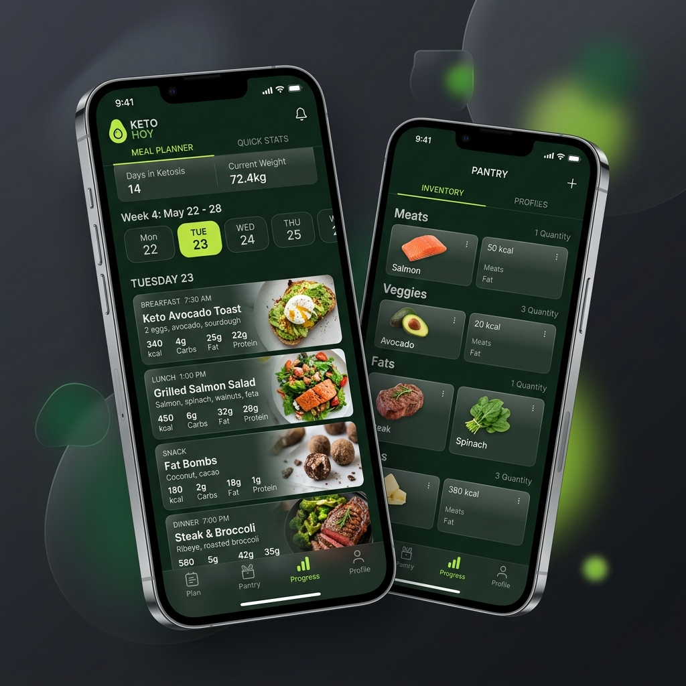

<p align="center">
  
</p>

<h1 align="center">KetoHoy (Mercadona)</h1>

<h3 align="center">Tu planificador de comidas keto y gestión de despensa inteligente.</h3>

<p align="center">
  <a href="#overview">Overview</a> •
  <a href="#project-structure">Project Structure</a> •
  <a href="#quick-start">Quick Start</a>
</p>

<p align="center">
  
  
  
</p>

<p align="center">
  
</p>

---

## ⚡ Overview
**KetoHoy** es una aplicación diseñada para facilitar el seguimiento de la dieta cetogénica (Keto) utilizando productos accesibles (enfocados en Mercadona). Integra gestión de despensa en tiempo real, generador de listas de la compra dinámico y recomendaciones de comidas basadas en los ingredientes que tienes en casa.

**Core Features:**
- **Control de Despensa:** Inventariado rápido de tus productos.
- **Ideas de Comida:** Generación de recetas inteligentes sugeridas basadas en la cobertura de ingredientes de tu despensa, calculando instantáneamente qué falta.
- **UX Premium:** Interfaz con animaciones fluidas (Framer Motion) adaptada para móviles con navegación Glassmorfismo.

## 🛠️ Project Structure
La estructura del proyecto está modularizada para escalabilidad y mantenimiento rápido:

- **`src/app/`**: Router principal de Next.js (App Router).
  - `/api`: Endpoints del backend (despensa, lista de compra, recetas).
  - `/inventory`: Gestión visual de tu despensa.
  - `/meals`: Sugerencias y visualización detallada de recetas.
  - `/shopping-list`: Interfaz de carrito.
  - `/weekly-plan`: Generador de menú semanal.
- **`src/components/`**: Componentes reutilizables de UI (Navigación, Tarjetas animadas).
- **`src/lib/`**: Lógica compartida.
- **`prisma/`**: Esquema de la base de datos (SQLite / Prisma) y scripts de semillas (`seed.ts`).

## 🚀 Quick Start
Asegúrate de configurar las variables de entorno en `.env` antes de inicializar la aplicación.

```bash
# 1. Instalar dependencias
npm install

# 2. Inicializar la base de datos
npx prisma db push
npm run prisma:seed

# 3. Arrancar servidor de desarrollo
npm run dev
```


